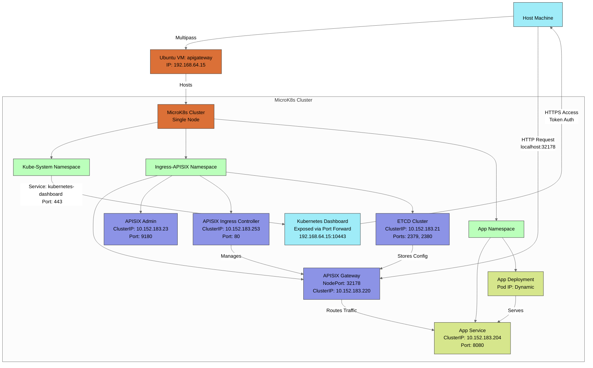
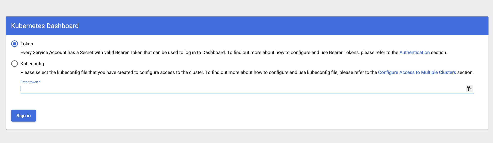
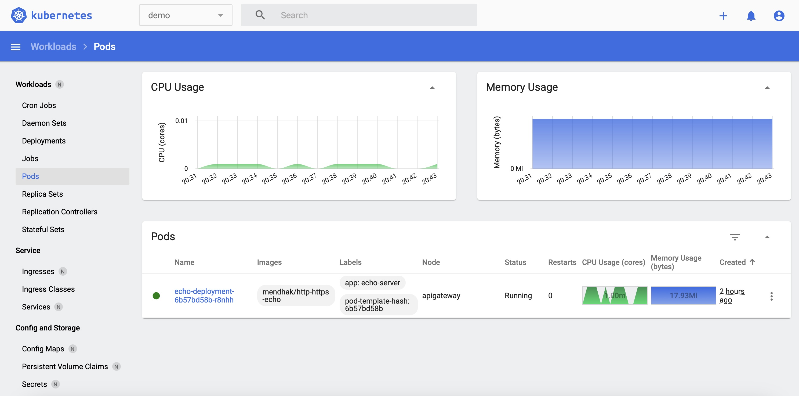
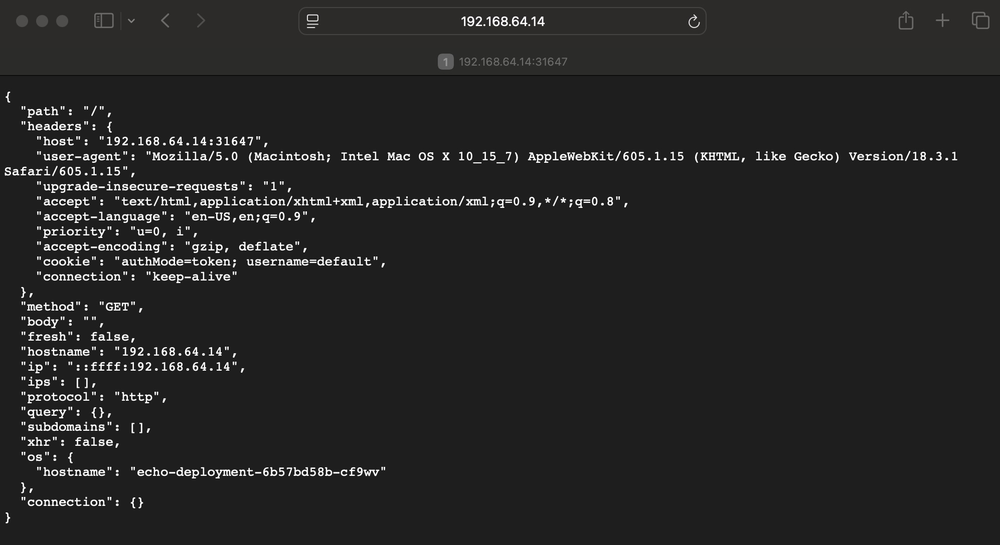

# API Gateway on a Local Kubernetes Instance

## Introduction
This guide walks you through setting up a local API Gateway using Multipass and MicroK8s. I used a Mac Pro with an Apple M2 Pro processor and 32GB of RAM for this setup, ensuring smooth performance while running the VM and Kubernetes cluster locally. By using Multipass to create a lightweight virtual machine (Ubuntu) and MicroK8s for a minimal Kubernetes cluster, you can quickly deploy the APISIX API Gateway along with a demo application for testing. This setup provides a self-contained environment that mirrors cloud-based Kubernetes deployments, making it ideal for development, experimentation, and learning. The guide covers everything from creating the VM and configuring Kubernetes to installing APISIX, accessing the dashboard, and deploying a sample application—all optimized for a local workflow.

<p align="center">
  
&nbsp; &nbsp; &nbsp; &nbsp;
  
</p>

---

## Architecture Overview

The following network block diagram illustrates the architecture of the local API Gateway setup, showing the key components and their network interactions. This includes the host machine (Mac Pro), the Ubuntu VM managed by Multipass, the MicroK8s Kubernetes cluster, the APISIX API Gateway components, and the demo application, all connected via specific IPs and ports.


---

## Prerequisites

- **Multipass**: A tool to quickly generate cloud-style Ubuntu VMs on Linux, macOS, or Windows.
- **Supported OS**: Linux, macOS, or Windows.
- **Hardware**: At least 4GB RAM, 10GB disk space, and 2 CPU cores available for the VM.

---

## Step 1: Install Multipass

Install Multipass to create and manage VMs:

```bash
# Visit the official site for installation instructions
https://canonical.com/multipass/install
```

---

## Step 2: Create a Virtual Machine

Launch an Ubuntu VM with specified resources:

```bash
multipass launch -c 2 -d 10g -m 4g -n apigateway
```

- `-c 2`: 2 CPU cores
- `-d 10g`: 10GB disk space
- `-m 4g`: 4GB memory
- `-n apigateway`: VM name

Verify the VM is running:

```bash
multipass list
```

**Example Output:**
```
Name         State    IPv4          Image
apigateway   Running  192.168.64.15 Ubuntu 24.04 LTS
```

Access the VM shell:

```bash
multipass shell apigateway
```

---

## Step 3: Set Up Kubernetes with MicroK8s

Install MicroK8s, a lightweight Kubernetes distribution:

```bash
sudo snap install microk8s --classic
```

**Example Output:**
```
2025-03-30T17:24:17-04:00 INFO Waiting for automatic snapd restart...
microk8s (1.32/stable) v1.32.2 from Canonical✓ installed
```

Configure permissions and directories:

```bash
mkdir ~/.kube
sudo usermod -a -G microk8s ubuntu
sudo chown -R ubuntu ~/.kube
exit
```

Restart the VM and reconnect:

```bash
multipass restart apigateway
multipass shell apigateway
```

Verify MicroK8s is ready:

```bash
microk8s status --wait-ready
```

**Example Output (partial):**
```
microk8s is running
high-availability: no
  datastore master nodes: 127.0.0.1:19001
  datastore standby nodes: none
addons:
  enabled:
    dns       # CoreDNS
    ha-cluster # High availability configuration
    helm      # Helm package manager
    helm3     # Helm 3 package manager
  disabled:
    dashboard # Kubernetes dashboard
    ingress   # Ingress controller
    ...
```

Enable additional addons:

```bash
microk8s enable dashboard
microk8s enable hostpath-storage
```

Install `kubectl` for interacting with Kubernetes:

```bash
sudo snap install kubectl --classic
```

Generate a kubeconfig file:

```bash
microk8s config > ~/.kube/config
```

---

## Step 4: Install APISIX API Gateway

Install Helm to manage Kubernetes packages:

```bash
sudo snap install helm --classic
```

Add required Helm repositories:

```bash
helm repo add apisix https://charts.apiseven.com
helm repo add bitnami https://charts.bitnami.com/bitnami
helm repo update
```

Set the APISIX admin API version (v3 in this example):

```bash
ADMIN_API_VERSION=v3
```

Install APISIX with Helm:

```bash
helm install apisix apisix/apisix \
  --set service.type=NodePort \
  --set ingress-controller.enabled=true \
  --create-namespace \
  --namespace ingress-apisix \
  --set ingress-controller.config.apisix.serviceNamespace=ingress-apisix \
  --set ingress-controller.config.apisix.adminAPIVersion=$ADMIN_API_VERSION
```

Verify services in the `ingress-apisix` namespace:

```bash
kubectl get service -n ingress-apisix
```

Get the APISIX Gateway URL:

```bash
export NODE_PORT=$(kubectl get -n ingress-apisix -o jsonpath="{.spec.ports[0].nodePort}" services apisix-gateway)
export NODE_IP=$(kubectl get nodes -n ingress-apisix -o jsonpath="{.items[0].status.addresses[0].address}")
echo http://$NODE_IP:$NODE_PORT
```

---

## Step 5: Access the Kubernetes Dashboard

Forward the dashboard port (run this in a second terminal):

```bash
multipass exec apigateway -- sudo /snap/bin/microk8s kubectl port-forward -n kube-system service/kubernetes-dashboard 10443:443 --address 0.0.0.0
```

**Output:**
```
Forwarding from 0.0.0.0:10443 -> 8443
```

Retrieve the dashboard token (run this in a third terminal):

```bash
multipass exec apigateway -- sudo /snap/bin/microk8s kubectl -n kube-system describe secret $(multipass exec apigateway -- sudo /snap/bin/microk8s kubectl -n kube-system get secret | grep default-token | cut -d " " -f1)
```

**Example Output (partial):**
```
Data
====
token: eyJhbGciOiJSUzI1NiIsImtpZCI6IjM5WW5zbVlYbHZWeVhIcmQ3dGJtaVlZb3dDOFJGZHR4ZXBoUnhsNUdfcEEifQ...
```

Access the dashboard at:

```
https://192.168.64.15:10443/#/login
```

Log in using the token from the previous step.



---

## Step 6: Deploy a Demo Application

Check APISIX endpoints and services:

```bash
kubectl get endpoints,service -n ingress-apisix
```

Test the gateway:

```bash
curl localhost:32178
```

**Expected Output:**
```
{"error_msg":"404 Route Not Found"}
```

Apply the demo application manifests:

```bash
kubectl apply -f namespace.yaml
kubectl apply -f deployment.yaml
kubectl apply -f service.yaml
kubectl apply -f ingress.yaml
```

Verify the demo resources:



```bash
kubectl get pod,service -n demo
```

**Example Output:**
```
NAME                                  READY  STATUS   RESTARTS  AGE
pod/echo-deployment-6b57bd58b-r8nhh   1/1    Running  0         2m39s

NAME                   TYPE       CLUSTER-IP      EXTERNAL-IP  PORT(S)    AGE
service/echo-service   ClusterIP  10.152.183.204  <none>       8080/TCP   6s
```

Test the demo application:

```bash
curl localhost:32178
```

**Example Output:**
```json
{
  "path": "/",
  "headers": {
    "host": "localhost:32178",
    "x-real-ip": "192.168.64.15",
    "x-forwarded-for": "192.168.64.15",
    "user-agent": "curl/8.5.0",
    "accept": "*/*"
  },
  "method": "GET",
  "body": "",
  "hostname": "localhost",
  "ip": "192.168.64.15",
  "protocol": "http",
  "query": {},
  "os": {
    "hostname": "echo-deployment-6b57bd58b-r8nhh"
  }
}
```


---

## Notes

- Replace `192.168.64.15` with your VM’s IP if it differs.
- For APISIX v2.x, adjust the `ADMIN_API_VERSION` to `v2` in Step 4.

---

## Advanced Topics

This section covers enhancements to the base setup, focusing on exposing the APISIX Gateway using a LoadBalancer service type with MetalLB instead of NodePort, providing a more production-like external access method.

### Using LoadBalancer with MetalLB

1. **Enable MetalLB in MicroK8s**  
   MetalLB provides LoadBalancer functionality in environments without a native cloud provider load balancer (like a local VM). Enable it with a specific IP range:

   ```bash
   microk8s enable metallb:10.64.140.43-10.64.140.49
   ```

   - This command enables the MetalLB addon and configures it to use the IP range `10.64.140.43` to `10.64.140.49`. Ensure this range is within your local network and does not conflict with existing IPs.

2. **Modify APISIX Installation to Use LoadBalancer**  
   In Step 4, replace `service.type=NodePort` with `service.type=LoadBalancer` in the Helm install command:

   ```bash
   helm install apisix apisix/apisix \
     --set service.type=LoadBalancer \
     --set ingress-controller.enabled=true \
     --create-namespace \
     --namespace ingress-apisix \
     --set ingress-controller.config.apisix.serviceNamespace=ingress-apisix \
     --set ingress-controller.config.apisix.adminAPIVersion=$ADMIN_API_VERSION
   ```

3. **Verify the Service**  
   Check the services in the `ingress-apisix` namespace:

   ```bash
   kubectl get service -n ingress-apisix
   ```

   **Example Output (Before MetalLB):**
   ```
   NAME                          TYPE           CLUSTER-IP       EXTERNAL-IP   PORT(S)        AGE
   apisix-gateway                LoadBalancer   10.152.183.220   <pending>     80:31642/TCP   5m
   ```

   **Example Output (After MetalLB):**
   ```
   NAME                          TYPE           CLUSTER-IP       EXTERNAL-IP     PORT(S)        AGE
   apisix-gateway                LoadBalancer   10.152.183.220   10.64.140.43    80/TCP         5m
   ```

   - Initially, the `EXTERNAL-IP` shows `<pending>`. Once MetalLB assigns an IP from the configured range (e.g., `10.64.140.43`), it updates to a specific address.

4. **Access the External IP Directly**  
   With `service.type=LoadBalancer` and MetalLB, you can now access the APISIX Gateway directly via the assigned external IP (e.g., `10.64.140.43`) without needing to use the VM’s IP and a NodePort (e.g., `192.168.64.15:32178`):

   ```bash
   curl http://10.64.140.43
   ```

   - This eliminates the additional hop required with NodePort, as the LoadBalancer IP is directly routable within your local network.

### Benefits
- **Simplified Access**: Direct access to the external IP mimics cloud environments more closely, avoiding port forwarding or NodePort mappings.
- **Scalability Prep**: Using LoadBalancer prepares the setup for multi-node clusters where MetalLB can distribute traffic.

### Notes
- Ensure the IP range (`10.64.140.43-10.64.140.49`) is compatible with your local network. Adjust it if necessary (e.g., to match `192.168.64.x` if that’s your VM’s subnet).
- MetalLB must be enabled before deploying APISIX with `LoadBalancer`, or you’ll need to update the service post-installation.

---

## References

1. **APISIX Ingress Controller GitHub**: [https://github.com/apache/apisix-ingress-controller](https://github.com/apache/apisix-ingress-controller) - Official GitHub repository for the APISIX Ingress Controller.
2. **APISIX Minikube Deployment Docs**: [https://apisix.apache.org/docs/ingress-controller/deployments/minikube/](https://apisix.apache.org/docs/ingress-controller/deployments/minikube/) - Documentation for deploying APISIX on Minikube (related reference).
3. **Docker HTTP/HTTPS Echo**: [https://code.mendhak.com/docker-http-https-echo/](https://code.mendhak.com/docker-http-https-echo/) - Source for the echo server used in the demo application.
4. **Multipass**: [https://github.com/canonical/multipass](https://github.com/canonical/multipass) - Virtual Ubuntu instances.
