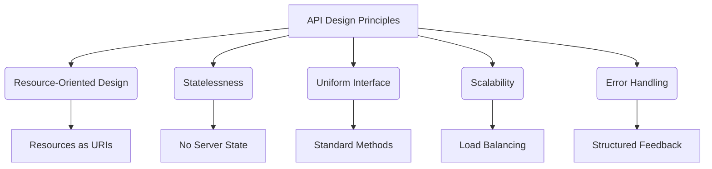
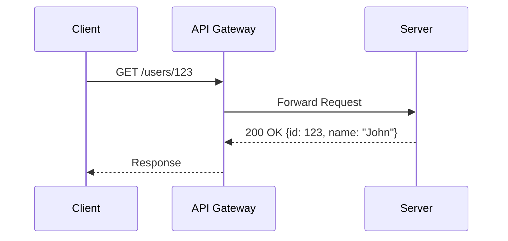
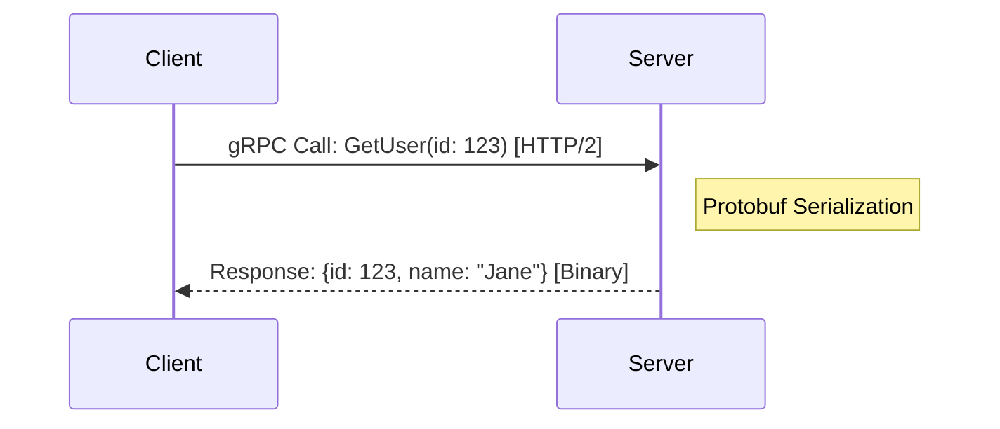
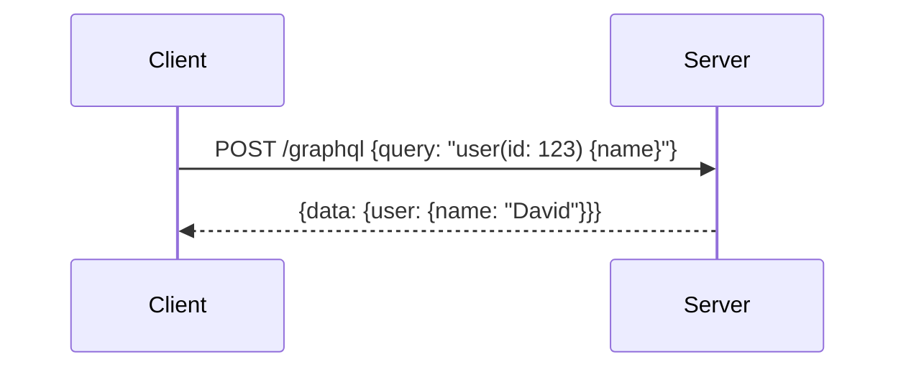
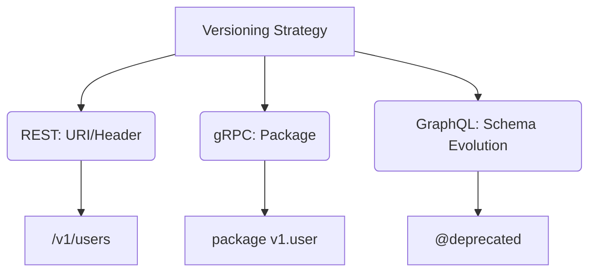
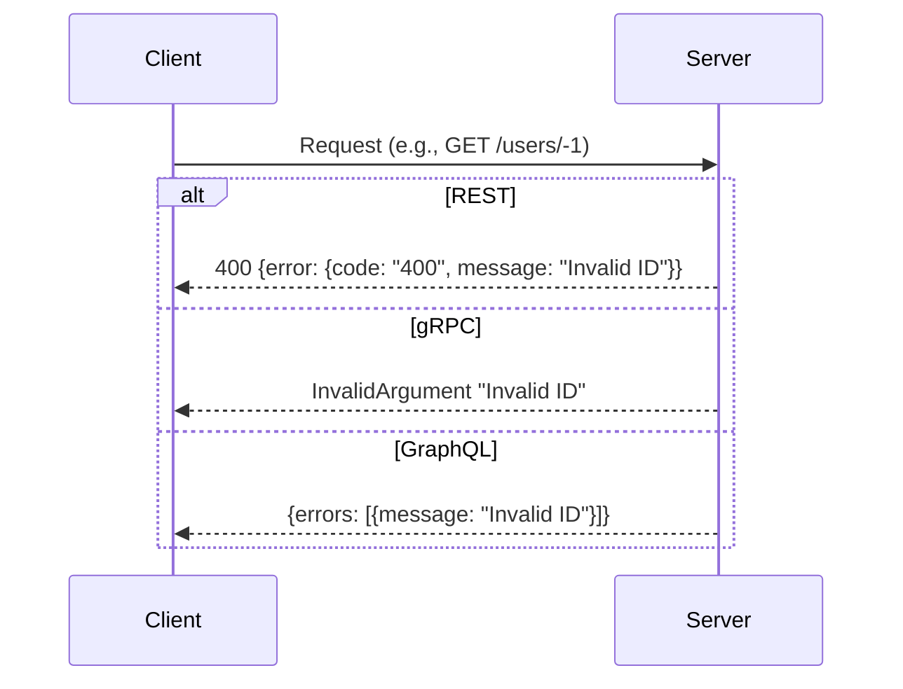

# API Design : Principles, Protocols, and Gateways

This chapter defines the foundational protocols, standards, and configurations essential for designing and implementing modern APIs. It establishes a framework that ensures consistency, scalability, and interoperability across systems, with support for **REST**, **gRPC**, **GraphQL**, and **Kafka**. API Gateways such as **APISIX** and **Kong** play a critical role in managing routing, security, and protocol bridging. Targeted at developers working with **C#**, **Java**, **Python**, and **Go**, this chapter offers precise definitions, practical examples, and actionable configurations to guide the development of robust and efficient APIs.

---

## 1. Design Principles

These design principles are fundamental guidelines that govern API architecture to ensure reliability, scalability, and maintainability. These principles apply across all API protocols and establish a consistent approach to resource management, communication, and error handling.

- **Resource-Oriented Design**: APIs represent data and functionality as resources (e.g., users, orders), accessed via unique identifiers or endpoints.
- **Statelessness**: Each request contains all necessary information, independent of prior requests, to enable scalability and fault tolerance.
- **Uniform Interface**: APIs use standardized methods, formats, and conventions (e.g., HTTP methods, JSON) for predictable interaction.
- **Scalability**: Designs support load distribution and growth without compromising performance.
- **Error Handling**: APIs provide structured, actionable feedback for failures, using consistent codes and messages.



---

## 2. API Protocols and Specifications

### 2.1 RESTful Architecture

REST (Representational State Transfer) is an architectural style that uses HTTP to manage resources through stateless communication. Resources are identified by URIs (e.g., `/users/123`), and actions are performed using HTTP methods: `GET` (retrieve), `POST` (create), `PUT` (update), `DELETE` (delete), and `PATCH` (partial update). Each request is independent, and responses may be cached using HTTP headers.

REST relies on HTTP’s built-in features, such as status codes (e.g., 200 OK, 404 Not Found) and headers (e.g., `Content-Type`), to facilitate communication. Resources are typically represented in JSON, and statelessness ensures that servers do not retain client context between requests, enabling load balancing across multiple instances.



**Best Practices**:
- Use plural nouns for resource URIs (e.g., `/users` instead of `/user`).
- Leverage HTTP status codes appropriately (e.g., 201 for created resources, 404 for not found).
- Include pagination for large datasets (e.g., `?limit=10&offset=20`).
- Support idempotency for `PUT` and `DELETE` operations.
- Use query parameters for filtering and sorting (e.g., `/users?role=admin`).
  
**Examples**:
- **C# (ASP.NET Core)**:
  ```csharp
  [Route("api/[controller]")]
  [ApiController]
  public class UsersController : ControllerBase
  {
      [HttpGet("{id}")]
      public ActionResult<User> GetUser(int id)
      {
          return Ok(new User { Id = id, Name = "John Doe" });
      }
  }

  public class User
  {
      public int Id { get; set; }
      public string Name { get; set; }
  }
  ```
- **Java (Spring Boot)**:
  ```java
  import org.springframework.web.bind.annotation.*;

  @RestController
  @RequestMapping("/users")
  public class UserController {
      @GetMapping("/{id}")
      public User getUser(@PathVariable Long id) {
          return new User(id, "John Doe");
      }
  }

  record User(Long id, String name) {}
  ```
- **Python (FastAPI)**:
  ```python
  from fastapi import FastAPI

  app = FastAPI()

  @app.get("/users/{user_id}")
  async def get_user(user_id: int):
      return {"id": user_id, "name": "John Doe"}
  ```
- **Go (Gin)**:
  ```go
  package main

  import "github.com/gin-gonic/gin"

  func main() {
      r := gin.Default()
      r.GET("/users/:id", func(c *gin.Context) {
          id := c.Param("id")
          c.JSON(200, gin.H{"id": id, "name": "John Doe"})
      })
      r.Run(":8000")
  }
  ```

**API Gateway Configuration**:
- **APISIX**:
  ```yaml
  routes:
    - uri: /users/*
      upstream:
        nodes:
          "127.0.0.1:8000": 1
        type: roundrobin
      plugins:
        proxy-rewrite:
          regex_uri: ["^/users/(.*)$", "/users/$1"]
  ```
- **Kong**:
  ```yaml
  services:
    - name: user-service
      url: http://127.0.0.1:8000
      routes:
        - name: user-route
          paths:
            - /users
          strip_path: false
  ```

---

### 2.2 gRPC

gRPC is a Remote Procedure Call framework that uses **Protocol Buffers** (Protobuf) for interface definition and HTTP/2 for transport. It enables efficient, type-safe communication between services, supporting unary calls, server streaming, client streaming, and bidirectional streaming.

gRPC employs Protobuf to define service contracts, generating client and server code in multiple languages. HTTP/2’s multiplexing reduces connection overhead, and binary serialization minimizes payload size compared to text-based formats like JSON. gRPC is designed for high-performance scenarios, such as microservices or distributed systems, where latency and throughput are critical.



**Protobuf Definition**:
```proto
syntax = "proto3";
package user;

service UserService {
    rpc GetUser (UserRequest) returns (UserResponse) {}
}

message UserRequest { int32 id = 1; }
message UserResponse { int32 id = 1; string name = 2; }
```

**Best Practices**:
- Define clear Protobuf messages with required fields to enforce data integrity.
- Use streaming only when necessary (e.g., real-time data) to avoid complexity.
- Include version numbers in package names (e.g., `v1.user`) for backward compatibility.
- Handle deadlines and cancellations via context to prevent resource leaks.
- Use gRPC’s built-in error codes (e.g., `codes.InvalidArgument`) consistently.

**Examples**:
- **C# (gRPC)**:
  ```csharp
  using Grpc.Core;
  using User;

  public class UserServiceImpl : UserService.UserServiceBase
  {
      public override Task<UserResponse> GetUser(UserRequest request, ServerCallContext context)
      {
          return Task.FromResult(new UserResponse { Id = request.Id, Name = "Jane Doe" });
      }
  }
  ```
- **Java (gRPC)**:
  ```java
  public class UserServiceImpl extends UserServiceGrpc.UserServiceImplBase {
      @Override
      public void getUser(UserRequest req, StreamObserver<UserResponse> responseObserver) {
          UserResponse response = UserResponse.newBuilder()
              .setId(req.getId())
              .setName("Jane Doe")
              .build();
          responseObserver.onNext(response);
          responseObserver.onCompleted();
      }
  }
  ```
- **Python (gRPC)**:
  ```python
  import grpc
  from user_pb2 import UserResponse
  from user_pb2_grpc import UserServiceServicer

  class UserService(UserServiceServicer):
      def GetUser(self, request, context):
          return UserResponse(id=request.id, name="Jane Doe")
  ```
- **Go (gRPC)**:
  ```go
  type userServer struct {
      pb.UnimplementedUserServiceServer
  }

  func (s *userServer) GetUser(ctx context.Context, req *pb.UserRequest) (*pb.UserResponse, error) {
      return &pb.UserResponse{Id: req.Id, Name: "Jane Doe"}, nil
  }
  ```

**API Gateway Configuration**:
- **APISIX (gRPC Transcoding)**:
  ```yaml
  routes:
    - uri: /v1/users/*
      upstream:
        nodes:
          "127.0.0.1:50051": 1
        scheme: grpc
      plugins:
        grpc-transcode:
          proto: "user.proto"
          service: "user.UserService"
          method: "GetUser"
  ```
- **Kong (gRPC Support)**:
  ```yaml
  services:
    - name: grpc-user-service
      url: grpc://127.0.0.1:50051
      protocol: grpc
      routes:
        - name: grpc-user-route
          paths:
            - /user.UserService/GetUser
  ```

---

### 2.3 GraphQL

GraphQL is a query language for APIs that enables clients to request specific data through a single endpoint (e.g., `/graphql`). It uses a schema to define data types and operations, including queries (data retrieval), mutations (data modification), and subscriptions (real-time updates).

GraphQL’s schema-driven approach allows clients to specify the exact structure of responses, reducing data over-fetching and under-fetching compared to REST. Queries and mutations are stateless, while subscriptions use WebSockets for persistent connections. The single-endpoint design simplifies routing, and strong typing ensures response consistency.



**Schema Example**:
```graphql
type User {
    id: ID!
    name: String!
}
type Query {
    user(id: ID!): User
}
```

**Best Practices**:
- Define a clear schema with non-nullable fields (e.g., `ID!`) where required.
- Limit query depth and complexity to prevent performance issues (e.g., using tools like `graphql-depth-limit`).
- Use fragments for reusable field selections.
- Implement pagination for list queries (e.g., `first`, `after` arguments).
- Deprecate fields explicitly with `@deprecated` instead of removing them immediately.
  
**Examples**:
- **C# (GraphQL.NET)**:
  ```csharp
  using GraphQL;
  using GraphQL.Types;

  public class UserType : ObjectGraphType
  {
      public UserType()
      {
          Field<IdGraphType>("id");
          Field<StringGraphType>("name");
      }
  }

  public class UserQuery : ObjectGraphType
  {
      public UserQuery()
      {
          Field<UserType>("user",
              arguments: new QueryArguments(new QueryArgument<NonNullGraphType<IdGraphType>> { Name = "id" }),
              resolve: context => new { Id = context.GetArgument<int>("id"), Name = "David" });
      }
  }
  ```
- **Java (GraphQL-Java)**:
  ```java
  import graphql.schema.*;

  public class UserSchema {
      public static GraphQLSchema createSchema() {
          GraphQLObjectType userType = GraphQLObjectType.newObject()
              .name("User")
              .field(GraphQLFieldDefinition.newFieldDefinition().name("id").type(GraphQLID))
              .field(GraphQLFieldDefinition.newFieldDefinition().name("name").type(GraphQLString))
              .build();

          GraphQLObjectType queryType = GraphQLObjectType.newObject()
              .name("Query")
              .field(GraphQLFieldDefinition.newFieldDefinition()
                  .name("user")
                  .type(userType)
                  .argument(GraphQLArgument.newArgument().name("id").type(GraphQLID))
                  .dataFetcher(env -> new User(Long.parseLong(env.getArgument("id")), "David")))
              .build();

          return GraphQLSchema.newSchema().query(queryType).build();
      }
  }

  record User(Long id, String name) {}
  ```
- **Python (Graphene)**:
  ```python
  import graphene

  class User(graphene.ObjectType):
      id = graphene.ID()
      name = graphene.String()

  class Query(graphene.ObjectType):
      user = graphene.Field(User, id=graphene.ID(required=True))

      def resolve_user(self, info, id):
          return User(id=id, name="David")
  ```
- **Go (graphql-go)**:
  ```go
  package main

  import (
      "github.com/graphql-go/graphql"
      "github.com/graphql-go/handler"
      "net/http"
  )

  func main() {
      userType := graphql.NewObject(graphql.ObjectConfig{
          Name: "User",
          Fields: graphql.Fields{
              "id":   &graphql.Field{Type: graphql.ID},
              "name": &graphql.Field{Type: graphql.String},
          },
      })

      queryType := graphql.NewObject(graphql.ObjectConfig{
          Name: "Query",
          Fields: graphql.Fields{
              "user": &graphql.Field{
                  Type: userType,
                  Args: graphql.FieldConfigArgument{
                      "id": &graphql.ArgumentConfig{Type: graphql.NewNonNull(graphql.ID)},
                  },
                  Resolve: func(p graphql.ResolveParams) (interface{}, error) {
                      return struct{ Id, Name string }{p.Args["id"].(string), "David"}, nil
                  },
              },
          },
      })

      schema, _ := graphql.NewSchema(graphql.SchemaConfig{Query: queryType})
      h := handler.New(&handler.Config{Schema: &schema})
      http.Handle("/graphql", h)
      http.ListenAndServe(":8080", nil)
  }
  ```

**API Gateway Configuration**:
- **APISIX**:
  ```yaml
  routes:
    - uri: /graphql
      upstream:
        nodes:
          "127.0.0.1:8080": 1
      plugins:
        proxy-rewrite:
          uri: "/graphql"
  ```
- **Kong**:
  ```yaml
  services:
    - name: graphql-service
      url: http://127.0.0.1:8080/graphql
      routes:
        - name: graphql-route
          paths:
            - /graphql
  ```

---

### 2.4 Versioning Strategy

Versioning is a mechanism to manage API changes while maintaining compatibility with existing clients. REST uses URI or header-based versioning, gRPC employs package versioning in Protobuf, and GraphQL relies on schema evolution.

Versioning ensures that updates (e.g., new fields, modified behavior) do not disrupt existing integrations. REST’s URI approach (e.g., `/v1/users`) is explicit and widely supported, while gRPC’s package versioning (e.g., `package v1.user`) is embedded in the service definition. GraphQL evolves schemas by adding fields and deprecating old ones, avoiding explicit versioning.



**Best Practices**:
- For REST, prefer URI versioning (e.g., `/v1/`) for clarity and simplicity.
- In gRPC, increment package versions (e.g., `v2.user`) for major changes.
- In GraphQL, add new fields instead of modifying existing ones, and use `@deprecated` with a reason.
- Document version lifecycles and deprecation timelines.
- Test backward compatibility before releasing new versions.
  
**Examples**:
- **C# (ASP.NET Core)**:
  ```csharp
  [Route("api/v{version:apiVersion}/[controller]")]
  [ApiController]
  [ApiVersion("1.0")]
  public class UsersController : ControllerBase
  {
      [HttpGet("{id}")]
      public IActionResult Get(int id)
      {
          return Ok(new { Id = id, Name = "Jane Doe" });
      }
  }
  ```
- **Java (Spring Boot)**:
  ```java
  @RestController
  @RequestMapping("/v1/users")
  public class UserController {
      @GetMapping("/{id}")
      public User getUser(@PathVariable Long id) {
          return new User(id, "John");
      }
  }
  ```
- **gRPC (Protobuf)**:
  ```proto
  syntax = "proto3";
  package v1.user;

  service UserService {
      rpc GetUser (UserRequest) returns (UserResponse) {}
  }
  ```
- **GraphQL (Schema Evolution)**:
  ```graphql
  type User {
      id: ID!
      name: String!
      age: Int @deprecated(reason: "Use birthYear instead")
      birthYear: Int
  }
  ```

**API Gateway Configuration**:
- **APISIX (REST Versioning)**:
  ```yaml
  routes:
    - uri: /v1/users/*
      upstream:
        nodes:
          "127.0.0.1:8080": 1
  ```
- **Kong (REST Versioning)**:
  ```yaml
  services:
    - name: user-service-v1
      url: http://127.0.0.1:8080
      routes:
        - name: user-route-v1
          paths:
            - /v1/users
  ```

---

### 2.5 Stateless Design

Stateless design requires each API request to include all necessary data, independent of server-side state, using mechanisms like tokens for authentication.

Statelessness eliminates server memory of prior requests, enabling any server to handle any request. This is achieved in REST with tokens (e.g., JWT), in gRPC with metadata, in GraphQL with stateless queries/mutations (subscriptions may use WebSockets), and in Kafka with stateless producers/consumers. Statelessness supports scalability and resilience in distributed systems.


**Best Practices**:
- Use JWT or similar tokens for authentication in REST and GraphQL.
- Pass metadata in gRPC for context (e.g., auth tokens, request IDs).
- Avoid server-side session storage; store state client-side or in external databases.
- Ensure idempotency for operations to handle retries gracefully.
- Validate tokens on each request to enforce security.
  
**Examples**:
- **C# (ASP.NET Core with JWT)**:
  ```csharp
  using Microsoft.AspNetCore.Authorization;
  using Microsoft.AspNetCore.Mvc;

  [Route("api/[controller]")]
  [ApiController]
  public class UsersController : ControllerBase
  {
      [HttpGet("{id}")]
      [Authorize]
      public IActionResult Get(int id)
      {
          return Ok(new { Id = id, Name = "John", Token = User.FindFirst("sub")?.Value });
      }
  }
  ```
- **Java (Spring Boot with JWT)**:
  ```java
  import org.springframework.security.core.annotation.AuthenticationPrincipal;
  import org.springframework.web.bind.annotation.*;

  @RestController
  @RequestMapping("/users")
  public class UserController {
      @GetMapping("/{id}")
      public User getUser(@PathVariable Long id, @AuthenticationPrincipal String token) {
          return new User(id, "John");
      }
  }
  ```
- **Python (FastAPI with JWT)**:
  ```python
  from fastapi import FastAPI, Depends
  from fastapi.security import OAuth2PasswordBearer

  app = FastAPI()
  oauth2_scheme = OAuth2PasswordBearer(tokenUrl="token")

  @app.get("/users/{user_id}")
  async def get_user(user_id: int, token: str = Depends(oauth2_scheme)):
      return {"id": user_id, "name": "John", "token": token}
  ```
- **Go (Gin with JWT)**:
  ```go
  func main() {
      r := gin.Default()
      r.GET("/users/:id", func(c *gin.Context) {
          token := c.GetHeader("Authorization")
          id := c.Param("id")
          c.JSON(200, gin.H{"id": id, "name": "John", "token": token})
      })
      r.Run(":8000")
  }
  ```

**API Gateway Configuration**:
- **APISIX (JWT Authentication)**:
  ```yaml
  routes:
    - uri: /users/*
      plugins:
        jwt-auth:
          key: "user-key"
          secret: "my-secret"
  ```
- **Kong (JWT Authentication)**:
  ```yaml
  plugins:
    - name: jwt
      config:
        key_claim_name: "user-key"
        secret_is_base64: false
  ```

---

## 3. Input/Output Standards

### 3.1 Response Format

Response formats standardize the structure and encoding of API outputs. REST and GraphQL use JSON, gRPC uses Protocol Buffers, and Kafka supports JSON, Avro, or custom serializers.

JSON is a text-based, human-readable format widely used in REST and GraphQL for its simplicity and compatibility. Protocol Buffers, used by gRPC, is a binary format that reduces size and parsing overhead. Kafka’s flexibility allows JSON for readability or Avro for schema enforcement in event-driven systems.

**Examples**:
- **REST (JSON)**:
  ```json
  {"id": 123, "name": "David"}
  ```
- **GraphQL (JSON)**:
  ```json
  {
    "data": {
      "user": {"id": "123", "name": "David"}
    }
  }
  ```
- **gRPC (Protobuf - Conceptual)**: Binary-encoded `{id: 123, name: "David"}`.
- **Kafka (JSON)**:
  ```json
  {"topic": "users", "value": {"id": 123, "name": "David"}}
  ```

**Best Practices**:
- Use JSON for REST and GraphQL unless performance requires alternatives (e.g., Protobuf).
- Ensure consistent field naming (e.g., camelCase or snake_case) across responses.
- Include metadata (e.g., timestamps, version) only when necessary to avoid bloat.
- For Kafka, use Avro with a schema registry for type safety in large-scale systems.
- Validate response payloads against schemas to catch errors early.

---

### 3.2 Error Handling

Error handling defines the structure and delivery of failure responses, including codes, messages, and details. REST uses HTTP status codes, gRPC uses Protobuf status codes, and GraphQL uses a JSON error array.

REST errors align with HTTP standards (e.g., 400 Bad Request), providing a JSON payload with details. gRPC uses predefined codes (e.g., `codes.InvalidArgument`) with optional messages. GraphQL returns errors within the response body, allowing partial success in queries.


**Best Practices**:
- Return machine-readable error codes (e.g., "400") and human-readable messages.
- Include detailed error descriptions (e.g., "ID must be positive") for debugging.
- Use standard codes (HTTP for REST, gRPC codes for gRPC) to align with protocol conventions.
- Log errors server-side with request context for traceability.
- In GraphQL, allow partial success by isolating errors to specific fields.
  
**Examples**:
- **C# (ASP.NET Core)**:
  ```csharp
  [HttpGet("{id}")]
  public IActionResult Get(int id)
  {
      if (id < 0) return BadRequest(new { Error = new { Code = "400", Message = "Invalid ID", Details = "ID must be positive" } });
      return Ok(new { Id = id, Name = "David" });
  }
  ```
  ```json
  {"error": {"code": "400", "message": "Invalid ID", "details": "ID must be positive"}}
  ```
- **Java (Spring Boot)**:
  ```java
  @GetMapping("/{id}")
  public ResponseEntity<?> getUser(@PathVariable Long id) {
      if (id < 0) return ResponseEntity.badRequest().body(new ErrorResponse("400", "Invalid ID", "ID must be positive"));
      return ResponseEntity.ok(new User(id, "David"));
  }

  record ErrorResponse(String code, String message, String details) {}
  ```
- **Python (FastAPI)**:
  ```python
  @app.get("/users/{user_id}")
  async def get_user(user_id: int):
      if user_id < 0:
          raise HTTPException(status_code=400, detail={"code": "400", "message": "Invalid ID", "details": "ID must be positive"})
      return {"id": user_id, "name": "David"}
  ```
- **Go (Gin)**:
  ```go
  func main() {
      r := gin.Default()
      r.GET("/users/:id", func(c *gin.Context) {
          id, _ := strconv.Atoi(c.Param("id"))
          if id < 0 {
              c.JSON(400, gin.H{"error": gin.H{"code": "400", "message": "Invalid ID", "details": "ID must be positive"}})
              return
          }
          c.JSON(200, gin.H{"id": id, "name": "David"})
      })
      r.Run(":8000")
  }
  ```

**API Gateway Error Handling**:
- **APISIX**:
  ```yaml
  plugins:
    response-rewrite:
      body: '{"error": {"code": "503", "message": "Service unavailable"}}'
      status_code: 503
  ```
- **Kong**:
  ```yaml
  plugins:
    - name: request-termination
      config:
        status_code: 400
        message: "Invalid request"
  ```

---
