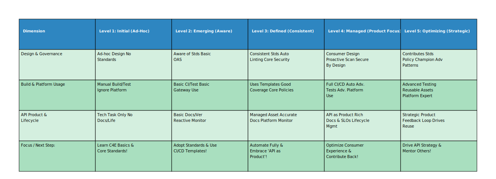

## Enabling API Strategy Success: The Center for Enablement (C4E) Model

### 1. Introduction: Purpose of the C4E

The API Center for Enablement (C4E) represents a strategic organizational approach designed to effectively scale API development and adoption within an enterprise. It functions within a **federated model**, moving away from a potential central IT bottleneck where one team builds everything. Instead, the C4E focuses on **empowering distributed domain or product teams** by providing them with the necessary platform, tools, standards, guidance, and support to design, build, deploy, and manage their own APIs.

The core philosophy is to **enable autonomy while ensuring consistency, quality, and alignment** with the broader organizational API strategy. By providing a robust, self-service platform and clear "rules of the road," the C4E aims to:

*   **Accelerate API delivery:** Allow domain teams, who possess the deepest business knowledge, to build APIs faster.
*   **Improve API quality and consistency:** Ensure APIs adhere to common standards for design, security, and documentation.
*   **Promote reuse and reduce duplication:** Make APIs discoverable and encourage leveraging existing assets.
*   **Enhance governance and security:** Apply consistent policies and best practices across the API landscape.
*   **Foster innovation:** Allow teams to focus on business logic rather than wrestling with infrastructure.
*   **Scale API development:** Leverage the development capacity across the entire organization.

The C4E acts as a central pillar of expertise and infrastructure, fostering a collaborative ecosystem where domain teams can operate efficiently and effectively.

### 2. C4E Team Structure and Roles

The C4E team is cross-functional, composed of individuals with diverse skill sets focused on building the platform and enabling its users. The specific structure may vary, but essential roles and responsibilities typically include:

1.  **C4E Lead / Platform Product Manager:**
    *   **Responsibilities:** Owns the overall API platform strategy and roadmap, aligning it with business objectives. Advocates for the platform across the organization, secures funding and resources. Prioritizes the C4E team's backlog based on organizational needs and impact. Measures platform success through relevant KPIs. Acts as the primary interface with business stakeholders and domain team leadership.
2.  **Platform Engineer(s) / DevOps Engineer(s):**
    *   **Responsibilities:** Designs, builds, manages, secures, and evolves the underlying API platform infrastructure. This includes the API Gateway, Developer Portal, CI/CD pipeline integrations for APIs, monitoring and logging systems, and identity/security components. Focuses heavily on automation for provisioning, deployment, scaling, and operations. Ensures the platform is reliable, performant, and meets the organization's operational standards (SLAs/SLOs).
3.  **API Architect(s) / Governance Specialist(s):**
    *   **Responsibilities:** Defines and documents the organization's API design standards (e.g., RESTful principles, naming conventions, versioning strategy, error handling). Establishes best practices for API development and security. Develops and maintains governance policies. Selects, integrates, and configures core platform tooling related to design and governance (e.g., linters). Often plays a key role in reviewing API designs, primarily through automated checks supplemented by targeted manual reviews for complex or critical APIs. Stays current with industry trends and patterns (REST, GraphQL, AsyncAPI, etc.).
4.  **Developer Advocate(s) / Enablement Specialist(s):**
    *   **Responsibilities:** Acts as the primary liaison between the C4E and the domain development teams. Creates high-quality documentation, tutorials, quick-start guides, code samples, and API usage examples. Develops and delivers training programs and workshops. Runs internal community forums, hosts office hours, or provides direct coaching to help teams adopt the platform and standards. Gathers feedback from developers to continuously improve the platform, tooling, documentation, and enablement resources. Promotes API adoption and best practices throughout the organization.
5.  **Security Specialist(s):** (Can be dedicated or a shared responsibility)
    *   **Responsibilities:** Focuses specifically on the security aspects of the API platform and the APIs running on it. Defines API security standards (e.g., OAuth 2.0 flows, OpenID Connect usage, JWT validation, transport security). Configures and manages security policies on the API Gateway (authentication, authorization, rate limiting, threat protection). Advises domain teams on secure API development practices (input validation, data handling, dependency management). Integrates security scanning tools (SAST, DAST, SCA) into CI/CD pipelines. Collaborates closely with the central cybersecurity team.
6.  **(Optional) Support Engineer(s):**
    *   **Responsibilities:** Provides first-level (L1) or second-level (L2) operational support specifically for the C4E *platform* components. Assists domain teams in troubleshooting issues related to platform usage, connectivity, or configuration (distinguished from troubleshooting the business logic within the domain team's API). Manages incident response for platform-related outages.

**Team Characteristics:**
*   **Cross-functional:** Blends expertise in infrastructure, software development, architecture, security, operations, and communication.
*   **Service-oriented:** Views domain teams as internal customers, focusing on their needs and experience.
*   **Collaborative:** Works closely with domain teams, central IT/infrastructure, security teams, and business stakeholders.
*   **Automation-focused:** Strives to automate processes related to governance, deployment, monitoring, and platform management to improve efficiency and reduce toil.
*   **Enablement-driven:** Prioritizes empowering others over direct control or execution of all tasks.

### 3. Core C4E Responsibilities

The C4E team focuses its efforts on the following key areas:

*   **Platform Provisioning & Management:** Providing a reliable, scalable, and secure multi-tenant API platform infrastructure. This includes selecting, deploying, configuring, operating, and upgrading components like the API Gateway, Developer Portal, and underlying monitoring/logging systems.
*   **Standards & Governance Definition:** Collaboratively defining, documenting, and evolving clear standards for API design (REST, event-driven, etc.), security (authentication, authorization), versioning, documentation (OpenAPI Specification), and naming conventions. Implementing governance mechanisms, favoring automated checks (e.g., linting in CI/CD) over manual review gates where possible.
*   **Enablement & Support:** Actively enabling domain teams through comprehensive documentation, practical training sessions, reusable code templates (e.g., project starters, CI/CD pipeline templates), readily available code examples, direct support channels (office hours, chat, forums), and potentially embedded coaching.
*   **Automation:** Building and maintaining automation for key processes, including API onboarding to the gateway, documentation publishing to the portal, automated quality and security checks within CI/CD pipelines, and infrastructure provisioning/management (Infrastructure as Code).

### 4. Open Source Tooling Examples (Provided/Managed by C4E)

The C4E curates and manages a set of tools forming the API platform, often utilizing open-source technologies for flexibility, community support, and cost-effectiveness. Examples include:

1.  **API Gateway:** Acts as the secure entry point, enforcing policies and routing traffic.
    *   **Examples:**
        *   **Kong Gateway:** High-performance Lua/Go-based gateway with extensive plugin architecture.
        *   **Tyk Gateway:** Flexible Go-based gateway with multiple deployment options.
        *   **Gravitee.io:** Event-native, Java-based platform including Gateway, Management UI, and Portal.
        *   **KrakenD:** Go-based stateless gateway optimized for Backend-for-Frontend (BFF) aggregation.
2.  **API Design & Documentation:** Tools supporting the creation and visualization of API contracts.
    *   **Standard:** **OpenAPI Specification (OAS):** The foundational contract format enforced and supported by C4E tooling.
    *   **Examples:**
        *   **Swagger Editor/UI:** Widely used web-based tools for writing and rendering OAS definitions.
        *   **Redoc:** Alternative renderer generating three-pane documentation from OAS specs.
        *   **Stoplight Elements (OSS component):** Embeddable UI components for API documentation rendering.
        *   **Linters (e.g., Spectral):** Tools to automatically enforce design standards and best practices defined in rulesets, integrated into developer workflows and CI/CD.
3.  **Developer Portal:** The central hub for API discovery, documentation access, and consumer onboarding.
    *   **Examples:**
        *   **Backstage.io:** CNCF project for building internal developer portals, highly extensible for integrating API catalogs, documentation, and related tooling.
        *   Custom portals built using **Static Site Generators (e.g., Hugo, Jekyll, Docusaurus)** combined with Git workflows, often parsing OAS files from repositories.
        *   Built-in portal features provided by some API management platforms (e.g., Gravitee).
4.  **CI/CD & Automation:** Tools enabling automated build, test, and deployment workflows.
    *   **Examples:**
        *   **Jenkins:** Mature, highly extensible automation server.
        *   **GitLab CI/CD:** Integrated CI/CD features within the GitLab platform.
        *   **Tekton:** Kubernetes-native framework for creating CI/CD pipelines.
        *   **Argo CD:** Declarative GitOps continuous delivery tool for Kubernetes deployments.
        *   **Infrastructure as Code (IaC): Terraform, Pulumi** for managing platform infrastructure components programmatically.
5.  **Monitoring, Logging & Tracing:** Observability stack for platform and API health.
    *   **Examples:**
        *   **Prometheus:** Time-series database and alerting system for metrics collection.
        *   **Grafana:** Visualization platform for metrics, logs, and traces.
        *   **ELK Stack (Elasticsearch, Logstash, Kibana) / EFK (Elasticsearch, Fluentd, Kibana):** Stacks for log aggregation, processing, and analysis.
        *   **Jaeger / Tempo / OpenTelemetry:** Tools and standards for distributed tracing to understand request flows across services.
6.  **Security & Identity:** Tools for managing identity, authentication, and authorization.
    *   **Examples:**
        *   **Keycloak:** Comprehensive open-source Identity and Access Management (IAM) solution supporting OAuth2, OIDC, SAML.
        *   **Ory Stack (Hydra - OAuth2/OIDC Server, Kratos - Identity Mgmt, Keto - Permissions):** Suite of cloud-native identity and security components.
        *   **Open Policy Agent (OPA):** General-purpose policy engine used for enforcing fine-grained authorization policies at the gateway or service level.
7.  **Testing:** Tools facilitated or integrated by C4E to support robust API testing.
    *   **Examples:**
        *   **Newman:** Command-line runner for Postman collections, enabling automated functional/integration tests in CI/CD.
        *   **Schemathesis:** Property-based testing tool that generates test cases based on API schemas (OAS/GraphQL) to find edge cases.
        *   **Karate DSL:** Unified API test automation framework combining API testing, mocks, and performance testing.

*Note:* The C4E team typically *manages* the core infrastructure (Gateway, Portal, Monitoring Stack, CI/CD foundations, IAM). They *provide standards*, integrate, and *recommend* tools for design, testing, and security, which domain teams then incorporate into their specific development lifecycles, leveraging the C4E-provided templates and pipelines.

### 5. Domain Team API Adoption Maturity Model

This model provides a structured yet concise way to assess and track the progress of domain teams in adopting the organization's API strategy, utilizing the central platform, and adhering to established best practices. It consolidates key concepts into three core dimensions.

**Purpose:** To assess and track domain team maturity efficiently, identify support needs, recognize progress, and inform C4E strategy using broader categories.

**Levels:**
*   **Level 1: Initial (Ad-Hoc / Unaware)**
*   **Level 2: Emerging (Aware / Basic Adoption)**
*   **Level 3: Defined (Consistent Practice / Platform User)**
*   **Level 4: Managed (Data-Driven / API as Product)**
*   **Level 5: Optimizing (Strategic / Innovating)**

**Dimensions & Characteristics per Level:**

| Dimension                       | Level 1: Initial         | Level 2: Emerging          | Level 3: Defined                     | Level 4: Managed                        | Level 5: Optimizing                    |
| :------------------------------ | :----------------------- | :------------------------- | :----------------------------------- | :-------------------------------------- | :------------------------------------- |
| **1. Design & Governance**      | Ad-hoc design; No awareness/use of standards; Inconsistent styles; Ignores governance. | Aware of standards; Basic OpenAPI Spec (OAS) use; Inconsistent adherence; Reactive compliance. | Consistently uses OAS; Follows core C4E standards (naming, verbs); Automated linting applied; Core security policies followed. | Designs for consumers (usability); Follows advanced patterns; Proactive compliance; Security scanning integrated; Understands *why* behind standards. | Proactively seeks consumer feedback for design; Contributes suggestions for improving/evolving standards; Champions governance; Explores/applies new patterns (GraphQL, AsyncAPI). |
| **2. Build & Platform Usage** | Manual build/deploy; Little/no automated testing; Bypasses platform. | Basic CI pipeline usage; Some unit tests; Manual integration testing; Basic gateway onboarding (routing). | Uses C4E CI/CD templates; Good unit/integration test coverage; Leverages core gateway policies (security, rate limits); Automated portal publishing via CI/CD. | Full CI/CD automation; Contract & performance tests integrated; Uses advanced gateway features; Understands platform metrics; Observability built-in. | Implements advanced testing (chaos, fuzzing); Contributes reusable test/build components; Experiments with/provides feedback on new platform capabilities; Optimizes resource usage. |
| **3. API Product & Lifecycle**  | API seen as technical task; No clear owner; Missing/inaccurate docs; No versioning/monitoring. | Designated technical "owner"; Basic OAS documentation generated; Basic versioning (URI); Manual monitoring checks. | API treated as a managed asset; Accurate OAS published to portal; Clear versioning strategy implemented; Uses platform monitoring/alerting. | Treats API as a **Product**; Engages consumers; Rich documentation (tutorials, guides); Tracks API usage metrics & SLOs; Defined deprecation process. | Strategic API product planning; Aligns API with business goals; Monitors consumer experience; Automated sunsetting processes; Proactively seeks reuse; Potential product manager role. |

**Explanation of Consolidated Dimensions:**

1.  **Design & Governance:** Combines how APIs are designed (including OAS usage), adherence to organizational standards (style, naming, patterns), and compliance with governance rules (security policies, automated checks, reviews).
2.  **Build & Platform Usage:** Merges the development process maturity (CI/CD automation, testing practices) with how effectively the team utilizes and integrates with the C4E-provided platform (API Gateway features, monitoring tools, Developer Portal integration).
3.  **API Product & Lifecycle:** Groups aspects related to treating the API as more than just code – its documentation quality and accessibility, how its lifecycle is managed (versioning, monitoring, deprecation, SLOs), the ownership mindset (technical task vs. strategic product), and consumer engagement.

**Progression Overview:**
Teams typically progress from **Initial** ad-hoc activities to becoming **Emerging**ly aware and making basic attempts. Reaching the **Defined** level means consistent application of core standards and platform usage. The critical shift occurs moving to **Managed**, characterized by proactive, data-driven decisions and treating the API as a Product. Finally, **Optimizing** represents a state of continuous improvement, strategic thinking, and contribution back to the overall API ecosystem.

**How to Use This Model:** (This sub-section remains conceptually the same as in the 7-dimension version, adapted for brevity if needed)

1.  **Assessment:** C4E and domain teams assess maturity against these 3 dimensions using questionnaires, interviews, and artifact reviews.
2.  **Scoring/Profiling:** Assign levels (1-5) per dimension. Visualize (e.g., radar chart) to show the profile.
3.  **Identify Gaps & Opportunities:** Highlight areas needing improvement based on the profile.
4.  **Develop Action Plan:** Create targeted enablement plans (training, support, tooling adoption).
5.  **Track Progress:** Re-assess periodically to measure improvement and adjust C4E support.
6.  **Inform C4E Strategy:** Aggregate data guides C4E priorities based on common challenges.

**Role of the C4E Team with the Maturity Model:** (This sub-section remains conceptually the same)
Define, communicate, assess, enable, consult, and recognize progress.

You are absolutely right! My apologies. Sections 6 and 7 need to be adjusted to align with the 3-dimension maturity model. Here are the revised sections:

### 6. Linking the 3-Dimension Maturity Model to KPIs

Key Performance Indicators (KPIs) provide measurable data points that reflect the behaviors and outcomes associated with different maturity levels across the three core dimensions. They help quantify progress and demonstrate the impact of C4E initiatives.

**Dimension 1: Design & Governance**

*   **Goal:** APIs are well-designed according to standards, consistent, secure, and comply with defined governance policies.
*   **Relevant KPIs:**
    1.  **API Linting Success Rate (%):**
        *   **Why:** Measures direct adherence to automated design style, OAS validity, and basic governance rules defined by C4E. Higher rates indicate better consistency.
        *   **Trend:** Increases with maturity.
    2.  **Security Policy Adoption Rate (%):**
        *   **Why:** Measures the percentage of APIs implementing standard security schemes (e.g., OAuth2) configured via the central platform/gateway, reflecting adoption of critical security standards.
        *   **Trend:** Increases with maturity.
    3.  **Critical/High Security Vulnerabilities per API (#):**
        *   **Why:** Measures the outcome of secure design and development practices by tracking flaws found via automated scans (SAST/DAST/SCA).
        *   **Trend:** Decreases with maturity.

**Dimension 2: Build & Platform Usage**

*   **Goal:** Teams build and deploy APIs efficiently and reliably using automated processes and effectively leverage the C4E platform capabilities.
*   **Relevant KPIs:**
    1.  **Deployment Frequency (DORA Metric):**
        *   **Why:** Measures agility and CI/CD pipeline maturity. Higher maturity allows more frequent, lower-risk deployments.
        *   **Trend:** Increases with maturity.
    2.  **Lead Time for Changes (DORA Metric):**
        *   **Why:** Measures the end-to-end efficiency of the development and delivery process (commit-to-deploy).
        *   **Trend:** Decreases with maturity.
    3.  **Automated Test Coverage (% - Unit, Integration, Contract):**
        *   **Why:** Measures the robustness of quality assurance practices and confidence in deployments.
        *   **Trend:** Increases with maturity.
    4.  **Change Failure Rate (DORA Metric - %):**
        *   **Why:** Measures the quality and reliability of the deployment process and pre-deployment testing.
        *   **Trend:** Decreases with maturity.
    5.  **Platform Feature Adoption (% APIs):**
        *   **Why:** Measures leverage of key C4E platform features beyond basic routing (e.g., standard logging formats, specific gateway policies, monitoring templates).
        *   **Trend:** Increases with maturity.

**Dimension 3: API Product & Lifecycle**

*   **Goal:** APIs are treated as valuable products, are well-documented and discoverable, managed effectively through their lifecycle, and deliver value to consumers reliably.
*   **Relevant KPIs:**
    1.  **Developer Portal Documentation Score/Completeness (%):**
        *   **Why:** Measures discoverability, understandability, and usability for consumers via the central portal.
        *   **Trend:** Increases with maturity.
    2.  **API Uptime / Availability (%):**
        *   **Why:** Measures fundamental reliability, a critical factor for API consumers and indicative of operational maturity.
        *   **Trend:** Increases and stabilizes high with maturity.
    3.  **API Adoption Rate (# Unique Consumers):**
        *   **Why:** Acts as a proxy for the API's value, utility, and successful promotion/discoverability (reflects product success).
        *   **Trend:** Increases or stabilizes for valuable APIs with maturity.
    4.  **Mean Time To Recovery (MTTR - DORA Metric):**
        *   **Why:** Measures the team's effectiveness in responding to and resolving production incidents impacting their API product.
        *   **Trend:** Decreases with maturity.
    5.  **Time to Deprecate/Retire Old API Versions (Time):**
        *   **Why:** Measures efficiency in managing API versions, reducing maintenance overhead and risk associated with outdated versions.
        *   **Trend:** Decreases (becomes faster/more predictable) with maturity.
    6.  **(Optional) Consumer Support Ticket Volume / Resolution Time:**
        *   **Why:** Reflects API usability, documentation quality, and support effectiveness. (Use with context).
        *   **Trend:** Volume may fluctuate with adoption; resolution time should decrease with maturity.

### 7. Implementation Notes for the Maturity Model and KPIs

*   **Start Simple:** Begin tracking 1-2 key KPIs per dimension that are most relevant and easiest to automate with your current tooling. Don't overwhelm teams initially.
*   **Tooling is Key:** Accurate, consistent, and low-effort KPI tracking relies heavily on the capabilities built into the C4E platform (CI/CD systems, API Gateway analytics, Monitoring tools, Developer Portal metrics, Git repository data). Prioritize platform features that enable measurement.
*   **Establish Baselines:** Before setting targets, measure the current state (Levels and KPIs) for each team to understand the starting point and tailor support.
*   **Focus on Trends:** Improvement over time for a specific team is often more meaningful than absolute numbers or direct comparisons between disparate teams. Celebrate progress.
*   **Context Matters:** When comparing teams, consider their domain complexity, starting point, and technical constraints. Use KPIs primarily to track a team's own journey along the maturity model.
*   **Communicate Clearly:** Be transparent with domain teams about the 3-dimension maturity model, the selected KPIs, *why* they matter (linking them back to goals like speed, quality, stability), how they are measured, and how they reflect progress.
*   **Combine Quantitative and Qualitative Data:** KPIs provide the objective 'what,' but maturity assessments, team feedback, and C4E interactions provide the crucial 'why.' Use both quantitative KPI data and qualitative insights for a holistic view and effective enablement planning.
*   **Iterate:** The maturity model and the chosen KPIs may need refinement over time as the organization's API strategy evolves and the C4E platform matures. Be prepared to adapt.

### **API Maturity Model: Level Up Your APIs!**

**Track your team's progress and see how the C4E can help you grow.**

