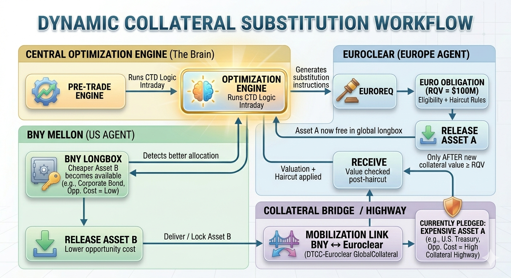
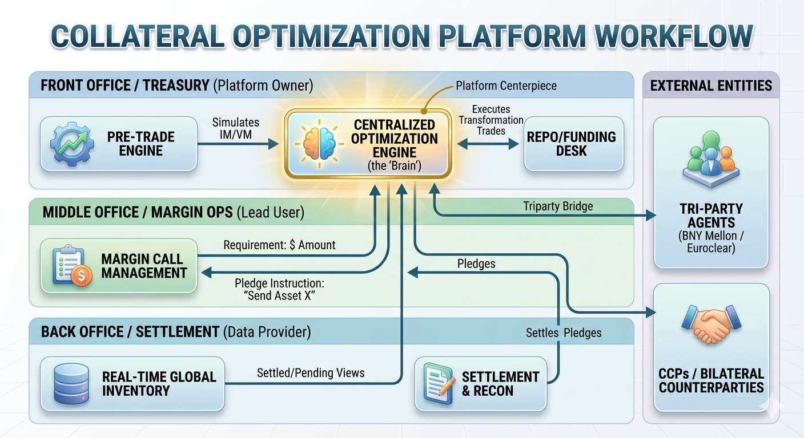
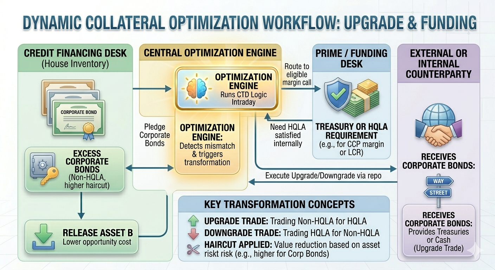
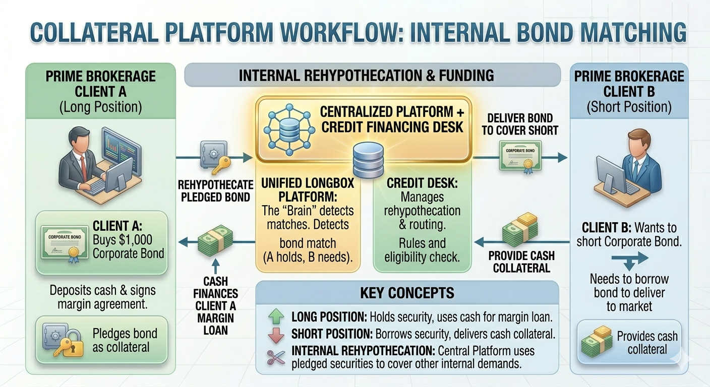

# Strategic Blueprint: Next-Generation Collateral Optimization & Liquidity Management

## Introduction
### What Is Collateral Optimization and Why Does It Matter?

A large bank or financial institution is a massive warehouse full of valuable items such as bonds, stocks, cash, etc. Every day, the bank must "pledge" (temporarily hand over) some of these items as **collateral** to borrow money, cover trading losses, or satisfy regulatory requirements. If the bank always gives away its most valuable or liquid items (like pristine U.S. Treasury bonds), it quickly runs into problems: it may not have enough high-quality assets left for emergencies, client needs, or regulatory buffers. This wastes money and creates risk.

**Collateral optimization** is the smart, automated process of deciding **exactly which assets to pledge** so the bank uses the **least expensive** (from its own perspective) and **most appropriate** assets for each obligation. The goal is to minimize "trapped liquidity" — situations where good assets are locked up unnecessarily — while meeting all legal, counterparty, and regulatory rules.
 
- It saves the firm money by reducing **funding costs** (the interest or opportunity cost of tying up assets).  
- It improves **liquidity management** (keeping cash and high-quality assets available when needed).  
- It ensures **regulatory compliance** without over-committing scarce resources.  

Poor optimization can cost millions daily in extra funding or regulatory penalties; good optimization turns collateral into a competitive advantage.

---

## 1. Triparty Financing: The Core Engine of Collateral Optimization

### What Is a Repo (Repurchase Agreement)?
A repo is essentially a short-term secured loan. One party (the **Collateral Giver** or borrower) sells securities to another party (the **Collateral Taker** or lender) today and agrees to buy them back tomorrow (or later) at a slightly higher price. The difference in price is the interest (funding cost). The securities act as collateral — if the borrower defaults, the lender keeps them.

### What Makes Triparty Repo Special?
In a **bilateral repo**, the two parties handle everything directly (risky and operationally heavy). In a **Triparty Repo**, a neutral third-party agent (e.g., BNY Mellon, JP Morgan, Euroclear, or Clearstream) sits in the middle and manages the collateral on behalf of both sides. This reduces risk and enables automation.

### How the Mechanism Works (Step by Step)
1. The Collateral Giver provides the triparty agent with a "longbox" — a virtual pool of all its available (unencumbered) securities. Think of this as a big warehouse inventory list.
2. The lender specifies an **Eligibility Schedule** — rules like "only AAA-rated government bonds, no more than 10% in any single issuer, minimum credit rating, etc."
3. The triparty agent's optimization engine runs an algorithm to automatically select the best securities from the longbox that meet the eligibility rules **and** are cheapest for the giver to pledge.
4. Securities are moved into a collateral account, cash is transferred, and the trade is settled.
5. Throughout the life of the repo, the agent handles daily revaluations, margin calls, income payments (coupons), and substitutions.

### Cheapest-to-Deliver (CTD) Optimization Explained
The engine does **not** pick randomly. It calculates which eligible asset has the **lowest opportunity cost** to the firm. Opportunity cost includes:
- Funding cost (how expensive it is to replace the asset if needed).
- Regulatory impact (does pledging this asset hurt liquidity ratios?).
- Yield/carry (what income am I losing by locking it up?).

**Real-World Example**:  
You owe $100 million in a triparty repo. You own:
- U.S. Treasuries (very safe, low haircut ~2%, highly liquid — you can easily sell or use them elsewhere; high opportunity cost).
- High-Yield Corporate Bonds (riskier, higher haircut ~10-25%, less liquid — cheaper for you to tie up because they are not your "best" assets).

If the lender accepts both, the engine pledges the corporate bonds first. This keeps your Treasuries free for stricter obligations (e.g., central clearing or regulatory buffers). Result: lower overall cost of funding and preserved high-quality assets.

This process runs **intraday** (multiple times a day) and supports automatic substitutions when a "cheaper" asset becomes available in the longbox.

---

## 2. Linking Financing (Triparty) with Derivatives Margin (IM and VM)

Derivatives trades — interest rate swaps, FX forwards, credit default swaps — create two distinct margin obligations that must be funded daily. These are the largest driver of collateral demand at most banks, and where optimization delivers its greatest value.

### Variation Margin (VM) — Daily Mark-to-Market Settlement

VM covers the overnight gain or loss on an open derivatives position. If your swap loses $10 million because rates moved against you, you owe your counterparty $10 million by the next morning.

**Cash vs. Securities**:
- **Cleared trades (CCP)**: Cash only — no exceptions. CCPs require immediate liquid settlement.
- **Bilateral OTC (CSA-governed)**: More flexible. Many CSAs permit government bonds or other eligible securities as VM, though cash dominates in practice due to valuation simplicity. The "cash only" characterization does not hold universally for bilateral trades.

**Optimization link**: When a firm owes VM cash but holds more bonds than cash, the Funding Desk repos bonds overnight to raise the required amount. The engine selects the cheapest eligible bonds — preserving HQLA for obligations where it is strictly required.

### Initial Margin (IM) — Forward-Looking Risk Buffer

IM is not tied to yesterday's move. It is a pre-funded buffer against the *potential* worst-case loss if a counterparty defaults and the position takes up to 10 days to close out.

**Calculation**: Bilateral IM under UMR is calculated using **ISDA SIMM**. Critically, SIMM is recalibrated annually — meaning IM requirements on existing trades can shift materially even when the underlying position has not changed. Systems must track and apply the current SIMM version at all times.

**Cash vs. Securities for IM**:
- Cash is technically permissible under most CSAs but is operationally disfavored: the receiver cannot re-hypothecate it, and it must sit idle in a segregated account — expensive for both sides.
- Securities dominate in practice. Government bonds and eligible investment-grade corporates are the standard form of bilateral IM collateral.
- At CCPs, each clearing house publishes its own eligible basket (typically government bonds and agency debt) with independent haircut schedules, separate from SIMM.

**Segregation requirement**: All bilateral IM must be held in a **triparty segregated account** (at BNY Mellon, Euroclear, or equivalent) — legally ring-fenced so that if the counterparty fails, assets are returned directly to the poster, not absorbed into the bankruptcy estate. The engine selects securities that meet the counterparty's eligibility schedule while preserving the firm's best HQLA for stricter obligations elsewhere.

### Why the Integration Matters

VM and IM together create a constant, unpredictable demand for cash and securities. Without coordinated optimization, three failure modes emerge:

- Premium Treasuries are pledged for a bilateral VM call that would have accepted corporates — leaving the firm short for a CCP deadline an hour later.
- VM cash is sourced via expensive external repo because the engine did not identify eligible internal bonds in time.
- A large new swap is executed without awareness that its $30 million IM call will require costly transformation trades, destroying the trade's expected P&L.

Good optimization treats VM, IM, and financing as **one integrated problem** — ensuring the cheapest available asset reaches the right obligation at the right time.

---

## 3. The Full End-to-End Workflow: Who Does What?

Collateral optimization is a coordinated, multi-party process. Within the firm, three internal functions each own a distinct part of the workflow: the Funding/Term Desk sets overall collateral strategy and decides which assets go where; Margin Operations receives daily margin calls and executes the resulting pledge instructions; and the Back Office/Settlement team maintains the real-time global inventory view that the engine depends on for accurate, up-to-date position data. Externally, Central Counterparties (CCPs) impose the strictest collateral requirements and are the primary driver of collateral transformation activity, while Triparty Agents provide the custodial and settlement infrastructure through which all collateral movements are physically executed. The optimization engine sits at the center, connecting all five — but it can only perform as well as the data and instructions flowing in from each party.

### A. Term Financing Desk — "The Brain"

Owns the firm's big-picture inventory view across all business lines (Fixed Income, Equity, Prime Brokerage, Credit). Its goal is to minimize the firm's overall Cost of Carry — deciding which assets go where, when to execute transformation trades, and how to ensure sufficient cash is always available for daily VM obligations. It also owns the pre-trade optimization function, ensuring that the collateral cost of new trades is priced into the client quote before execution rather than discovered after the fact.

### B. Margin Operations — "The Execution Arm"

Receives daily margin calls from counterparties and CCPs, feeds the requirement (amount owed plus eligibility rules) into the optimization engine, and executes the resulting pledge instructions (specific CUSIPs/ISINs to move). Margin Operations also owns dispute resolution when a counterparty's margin call differs from the firm's own calculation, and reconciliation of pledged collateral balances against counterparty statements. It is the primary day-to-day user of the optimization engine's output and the desk most directly exposed when an instruction fails or a call is missed.

### C. Back Office / Settlement — "The Data Foundation"

Provides the optimization engine with its most critical input: a real-time, accurate view of what the firm actually owns and what is already encumbered. This includes confirmed settled positions, pending settlement status, and corporate action flags that restrict which assets can be moved on any given day. Without reliable inventory data flowing from settlement, the engine may attempt to pledge assets that are already committed elsewhere or have not yet settled — creating operational fails or margin breaches. The settlement team also owns end-of-day reconciliation against triparty agent and custodian statements, ensuring the engine's internal longbox view matches the external record.

### D. Central Counterparty (CCP) — "The Strictest Gatekeeper"

Acts as buyer to every seller and seller to every buyer, eliminating bilateral counterparty risk for cleared derivatives and repo trades. CCPs impose the most stringent eligibility schedules of any participant in the workflow — typically accepting only high-quality government bonds or cash, with limited tolerance for corporate bonds or equities. When the firm lacks sufficient eligible collateral to meet a CCP margin call, the Funding Desk must execute a Collateral Transformation trade — for example, repoing out corporate bonds to borrow Treasuries — before the CCP obligation can be satisfied. Because CCP margin calls carry strict intraday deadlines and default consequences, they are always prioritized first in the optimization engine's allocation sequence.

### E. Triparty Agents — "The Execution Infrastructure"

Triparty agents (principally BNY Mellon in the US and Euroclear or Clearstream in Europe) are the external custodians that physically hold and move collateral on behalf of both the firm and its counterparties. When the optimization engine generates a pledge or substitution instruction, it is the triparty agent that validates eligibility, applies haircuts, settles the movement, and confirms completion back to the firm. They also publish real-time collateral valuations and eligibility schedule updates that feed directly into the engine's decision logic. While they do not make optimization decisions themselves, the speed and reliability of the entire workflow depends on the quality of the firm's API connectivity and data feeds with these agents. In cross-border scenarios, triparty agents also operate the collateral bridge infrastructure — such as Euroclear's Collateral Highway and the DTCC-Euroclear GlobalCollateral link — that allows assets to be mobilized across custodians intraday without full physical transfer.

---

## 4. Key Terminology Explained in Detail

### Longbox vs. Omnibus Account
- **Longbox**: The virtual "warehouse" of all **unencumbered** (free, not already pledged) securities the firm owns globally. The optimization engine scans this in real time to find the best available assets for any obligation.
- **Omnibus Account**: One shared custodial account that holds assets for many internal desks or clients. The triparty agent handles internal bookkeeping so ownership remains clear at all times.
- **Cheapest-to-Deliver (CTD)**: The asset pulled from the longbox that satisfies all eligibility rules at the lowest overall cost or opportunity to the firm. This is what the engine is always solving for.

### Uncleared Margin Rules (UMR)
Post-2008 regulations (phased in globally since 2016) require firms to exchange **Initial Margin** for OTC derivatives not cleared through a CCP. Before UMR, many firms only exchanged VM in cash. Now they must segregate billions in securities as IM — creating enormous demand for optimization, since firms can no longer afford idle high-value assets.

- **Triparty Segregated Account**: For UMR IM, assets must be held by a neutral third-party custodian in a legally separate account. If the counterparty fails, your assets are protected and returned quickly — they cannot be commingled with the counterparty's own assets.

### Cost of Carry
The net cost of holding an asset = income it generates (coupons, dividends) minus the cost to fund it.

**Optimization Priority**: Pledge low or negative carry assets first. Freezing a high-yielding bond when a low-yielding one would satisfy the same obligation is a direct, measurable loss.

- **KVA (Capital Value Adjustment)**: Quantifies the lifetime capital cost a new trade will impose on the firm. Feeds into pre-trade pricing so traders see the true all-in cost before executing. Two types of capital are relevant here and must not be conflated:

- **Regulatory capital** (e.g., under SA-CCR or the standardized approach under Basel IV) is the minimum capital the firm must hold as dictated by the regulator. It is formula-driven and non-negotiable.
- **Economic capital** is the firm's own internal estimate of the capital it should hold against a trade, based on its risk model. It is typically higher than the regulatory floor and reflects the firm's actual risk appetite.

KVA strictly measures the cost of holding **economic capital** over the life of a trade — not the regulatory minimum. The distinction matters because two trades with identical regulatory capital charges can have very different KVAs if one carries tail risk the firm's internal model penalizes more heavily. In pre-trade optimization, using regulatory capital as a KVA proxy systematically underestimates the true lifetime cost of capital-intensive trades, leading to mispriced client quotes.

Post-Basel IV (SA-CCR replacing CEM), the regulatory and economic capital figures have converged somewhat for vanilla derivatives, but diverge significantly for long-dated, illiquid, or exotic trades — exactly the trades where pre-trade optimization adds the most value.
- **LVA (Liquidity Value Adjustment)**: The equivalent adjustment for liquidity cost — how much a trade will drain the firm's liquidity buffer over its life.

### Credit Support Annex (CSA) and Eligibility Schedules
The legal document (part of the ISDA Master Agreement) that spells out exactly what collateral is accepted, with haircuts, concentration limits, and substitution rights. Digitizing these into machine-readable rules is the foundation of automation — without it, the engine cannot run.

- **Haircut Arbitrage**: The same bond may receive an 8% haircut under one CSA and 12% under another. The engine automatically routes assets to the counterparty offering the most favorable haircut, generating more collateral credit from the same asset across the inventory.
- **Linear Programming Optimizer**: The mathematical engine that finds the best allocation of assets across hundreds of simultaneous constraints (eligibility, haircuts, concentration limits, LCR/NSFR). It replaces manual spreadsheet-driven decisions with a provably optimal solution.

### Collateral Infrastructure Terms
- **Collateral Bridge / Highway**: Infrastructure (e.g., Euroclear's Collateral Highway, DTCC-Euroclear GlobalCollateral) that allows assets or collateral value to move efficiently between custodians intraday — often without full physical transfer — enabling cross-agent substitution across time zones.

**Consolidated Reference Table**

| Term | Simple Purpose |
|---|---|
| **Longbox** | Raw material warehouse of free, unencumbered securities |
| **CTD** | The cheapest eligible asset the engine selects to pledge |
| **UMR** | Regulation forcing segregated IM on uncleared derivatives |
| **Triparty Segregated Account** | Protected vault keeping IM safe from counterparty failure |
| **CSA / Eligibility Schedule** | The rulebook of what each counterparty accepts |
| **Haircut Arbitrage** | Routing assets to the counterparty with the most favorable haircut |
| **Cost of Carry** | Net cost of holding an asset after income minus funding expense |
| **KVA / LVA** | Lifetime capital and liquidity cost adjustments embedded in pre-trade pricing |
| **Collateral Bridge** | Infrastructure enabling cross-agent, cross-border asset mobilization |
| **Linear Programming** | Mathematical optimizer solving the best allocation under all constraints simultaneously |

---

## 5. Cross-Agent Optimization and the "Collateral Highway" (Solving Trapped Liquidity)

Large banks hold assets across multiple custodians (BNY Mellon in the US, Euroclear/Clearstream in Europe). Often, high-quality bonds sit idle in one location while the firm borrows cash expensively in another — "trapped collateral."

**Solution**: Create a **global virtual longbox** that aggregates inventory across agents via APIs. Optimization engines then decide the best use of assets anywhere in the network.

### Collateral Transformation (Upgrade vs. Downgrade)
- **Upgrade Trade**: You have lower-quality bonds (e.g., BB corporates) but need Treasuries for a CCP. You repo your corporates to a counterparty and receive Treasuries in return (for a fee).
- **Downgrade Trade**: You accidentally pledged expensive Treasuries for a trade that accepts junk bonds. Pull them back and replace with cheaper eligible assets to free up HQLA.

### How Cross-Agent Optimization Works (Step by Step)
1. **Aggregation**: Central system pulls real-time data from all agents into one virtual longbox.
2. **Objective Function**: Algorithm minimizes total funding cost + regulatory impact (LCR/NSFR).
3. **Auto-Substitution ("The Shuffle")**: If a cheaper asset appears at BNY, the system releases a more expensive one at Euroclear and bridges the difference.
4. **Bridging / Collateral Highway**: Services like Euroclear’s Collateral Highway or DTCC-Euroclear GlobalCollateral allow intraday movement of value or assets across borders and time zones without full physical transfer.

**Why Banks Invest Here**:
- Lower external borrowing costs.
- Better regulatory ratios (LCR/NSFR).
- Reduced concentration risk.
- Ability to respond to margin calls in different time zones.

### 5.1 Auto-Substitution ("The Shuffle"): How It Works in Practice

One of the most powerful features of a modern collateral optimization engine is **auto-substitution** — continuously improving the firm's collateral allocation by replacing costly assets with cheaper eligible ones, without disrupting any underlying obligations.

#### What Triggers Auto-Substitution?
The engine monitors four key signals:
- The global virtual longbox across all triparty agents.
- Current pledged collateral vs. required collateral value (RCV) at each counterparty.
- Relative cost ranking of every asset (carry, haircut efficiency, LCR/NSFR impact, opportunity cost).
- New events — a cheaper asset becoming unencumbered, a margin call, or a change in eligibility rules.

When a better allocation is identified, substitution instructions are generated automatically.

#### Core Principle: Value Must Always Balance
Substitution is a precisely orchestrated process — replacement collateral must provide **equal or greater collateral value** (after haircut) before the original asset is released. Most agents operate on a **"Give Before You Get" (GBYG)** basis: the new collateral is accepted first, then the expensive asset is freed. No account goes underwater, even momentarily.

#### Cross-Agent Shuffle Example (BNY Mellon → Euroclear)
The firm holds expensive U.S. Treasuries at Euroclear satisfying an ongoing obligation, while a cheaper investment-grade corporate bond has just become available at BNY Mellon.

1. **Detection** — The engine identifies the swap reduces cost of carry while still meeting Euroclear's eligibility and concentration rules.
2. **Instruction Generation** — Coordinated instructions are sent to both agents: Euroclear prepares to receive the replacement; BNY releases the corporate bond from the longbox.
3. **Mobilization** — The asset moves via a collateral bridge (e.g., Euroclear's Collateral Highway or DTCC-Euroclear GlobalCollateral). Full physical transfer is often unnecessary — a linked credit mechanism locks the asset at BNY and grants immediate collateral credit at Euroclear.
4. **Balanced Execution** — Euroclear accepts and values the new collateral. Only once it meets the required threshold is the Treasury released back to the longbox for higher-value use.

**Net Result**: Lower cost of carry, preserved HQLA, and zero disruption to the underlying obligation.

### 5.2 Settlement Risk, Fails-to-Deliver, and Intraday Contingency**

When a substitution instruction is generated, it must settle — and settlement can fail. A fail occurs when the delivering custodian cannot complete the transfer intraday, typically because the replacement asset is tied up in a pending settlement from an earlier trade, or because the triparty agent's cut-off window has passed.

**Why this matters operationally**: A failed substitution leaves the expensive asset locked at the obligation longer than intended, directly increasing cost of carry for that day. More critically, if the fail occurs on a margin call deadline, the firm may be in technical breach of its collateral agreement, triggering dispute procedures or — in extreme cases — a margin default notice.

**Contingency controls the engine must enforce**:
- **Settlement buffer timing**: Substitution instructions must be generated early enough to allow for the agent's intraday settlement cycle (typically before 3–4pm local cut-off). Late-day CTD runs should flag assets with pending upstream settlements as ineligible for substitution that day.
- **Fail tracking feed**: The optimization engine must consume a real-time "settled vs. pending" feed from the back office. Any asset showing "pending" status cannot be treated as free in the longbox until confirmed settled.
- **Contingency queue**: If a substitution fails, the engine automatically identifies the next-cheapest eligible asset and re-issues the instruction — without human intervention. This requires pre-ranked fallback asset lists per obligation, not just a single CTD pick.
- **Corporate action blocks**: Bonds approaching a coupon date, call date, or maturity should be automatically flagged as substitution-ineligible in the relevant window, since the triparty agent will exclude them from eligible inventory anyway.

**Cross-agent dimension**: Fails are more likely and more expensive when crossing custodians (BNY Mellon → Euroclear), because the mobilization link adds a processing step. Cross-agent substitutions should carry a wider settlement buffer and a stricter fallback trigger threshold.

---

## 6. Regulatory Guardrails: LCR, NSFR and SFTR Reporting Explained Simply

These Basel III ratios force banks to hold enough liquidity and stable funding. Optimization engines must respect them in real time.

### Liquidity Coverage Ratio (LCR) — The 30-Day Sprint
**Formula**:  
$$\frac{\text{Stock of High-Quality Liquid Assets (HQLA)}}{\text{Total Net Cash Outflows in a 30-day stress scenario}} \geq 100\%$$

- **Focus**: Can the bank survive a short, severe crisis (mass withdrawals, market freeze) for 30 days?
- **HQLA**: Treasuries, central bank reserves, etc. (with haircuts applied to less liquid assets).
- **Optimization Goal**: Hold the **minimum** required HQLA so the rest of the balance sheet can be invested in higher-yielding assets.

### Net Stable Funding Ratio (NSFR) — The 1-Year Marathon
**Formula**:  
$$\frac{\text{Available Stable Funding (ASF)}}{\text{Required Stable Funding (RSF)}} \geq 100\%$$

- **Focus**: Are long-term assets (e.g., 30-year mortgages) funded by stable sources (long-term deposits, equity) rather than flighty short-term borrowing?
- **Optimization Goal**: Avoid over-reliance on short-term wholesale funding.

**Key Point for Optimization**: The engine must never pledge so much HQLA that these ratios breach thresholds (including internal buffers). This adds another layer of constraints to the mathematical problem.

### SFTR Reporting Obligations

Any repo or securities lending transaction executed by a firm operating in the EU or UK falls under the **Securities Financing Transactions Regulation (SFTR)**, which requires both counterparties to report transaction-level data to a trade repository by T+1. The optimization engine's decisions directly generate SFTR reportable events — every new repo, substitution, and early termination must be captured.

**What must be reported**: Counterparty identifiers (LEI), trade economics (rate, maturity, collateral basket), daily mark-to-market revaluation, and collateral substitutions. For triparty repos, the triparty agent typically provides a standardized data feed that maps to SFTR fields — but the firm remains legally responsible for report accuracy and completeness.

**Impact on system design**: The optimization engine must be designed to emit a structured event log for every instruction it generates — not just for execution, but for regulatory audit. Each CTD selection, substitution trigger, and downgrade trade must carry a timestamp, asset identifier (ISIN/CUSIP), counterparty LEI, and reason code. Without this, the firm cannot reconcile its SFTR reports against actual collateral movements, creating regulatory risk independent of the optimization logic itself.

**UK SFTR post-Brexit**: The UK operates its own version of SFTR (onshored into UK law), which is substantively identical but reported to UK-authorized trade repositories. Firms operating across both jurisdictions must report to both — the data model must support dual-reporting without double-counting.

---

## 7. How the Optimization Engine Actually Works: Three Critical Data Layers + Algorithms

To run a modern collateral optimization platform, the system needs a high-fidelity “digital twin” of the bank’s entire balance sheet and operations. This is achieved through **three distinct data layers** that feed into a powerful optimization algorithm. 

The engine does not simply pick the “first available” asset. It solves a complex mathematical problem in real time (often multiple times per day) using techniques such as **Linear Programming (LP)** or mixed-integer programming. The goal is to find the global minimum **Cost of Carry** while satisfying hundreds of constraints: eligibility rules, haircuts, concentration limits, LCR/NSFR buffers, and opportunity costs.

Below is a detailed breakdown of the three layers, followed by an in-depth exploration of **Pre-Trade Optimization** — the newest and most strategic frontier in collateral management.

### 7.1 Layer 1: The Inventory & Settlement View (The “Truth” Layer)

Before any optimization can occur, the system must know exactly what the firm **actually owns and can use right now**.

- **Real-time feeds** from every triparty agent (BNY Mellon, Euroclear, Clearstream, JP Morgan, etc.) and internal custody systems.
- **Settlement status**: Distinguishes between “settled” assets (ready to pledge) and “pending” assets (trades that have been executed but not yet settled — these cannot be used).
- **Unencumbered inventory**: Only free (unpledged) securities enter the **Virtual Global Longbox**.
- **Why it matters**: Without accurate settlement data, the optimizer could try to pledge “phantom” inventory. This would cause failed margin calls, penalties, or forced expensive borrowing in the open market.

**Practical Example**: A trader executes a bond purchase at 10:00 AM. The system does not make that bond available for pledging until the settlement confirmation arrives (often T+1 or T+0 intraday). The engine continuously refreshes this view via APIs so the longbox is always current.

### 7.2 Layer 2: The Rules Engine (Legal & Eligibility Filter)

This layer digitizes and enforces all the “fences” created by legal agreements.

- Ingests **CSAs** (Credit Support Annexes), **GMRAs** (Global Master Repurchase Agreements), triparty eligibility schedules, and CCP rulebooks in machine-readable format.
- For every margin call or repo obligation, it applies filters such as:
  - Asset class (e.g., only AAA government bonds or investment-grade corporates).
  - Credit rating, maturity, issuer concentration limits (e.g., “no more than 10% in any single issuer”).
  - Specific haircuts and valuation methodologies.
- Outputs a **filtered eligible inventory** list from the global longbox.

**Why it matters**: Manual review of 50+ different CSAs would be impossible at the speed required today. The rules engine makes the entire process automated and auditable for regulators.

### 7.3 Layer 3: The Optimization Algorithm (The Math Engine)

With clean inventory and filtered eligibility, the core algorithm solves for the **CTD** allocation.

- **Objective function**: Minimize total Cost of Carry + opportunity cost across the firm.
- **Constraints**: Hundreds of rules from Layer 2 + real-time LCR/NSFR guardrails.
- **Technique**: Linear Programming (or similar solvers) that can evaluate thousands of possible combinations in seconds and pick the optimal set of assets to pledge.

This layer runs **post-trade** (after a margin call arrives) but is increasingly used **pre-trade** (see next subsection).

The algorithm also drives auto-substitution (see Section 5.1) — continuously re-optimizing pledged collateral as cheaper assets become available intraday.

### 7.4 In-Depth: Pre-Trade Optimization — "Before the Handshake"

**Traditional (post-trade) optimization** happens *after* a trade is executed and a margin call is received. **Pre-trade optimization** shifts the intelligence to the quoting and decision phase — before the trader executes — allowing the firm to price the true all-in cost of a trade before committing to it.

Without this, a trade that appears profitable on a mark-to-market basis may destroy value once the lifetime cost of trapped liquidity, transformation trades, and regulatory capital is factored in.

#### What the Pre-Trade Engine Provides

When a trader queries the engine via API, it returns — a liquidity-adjusted price that incorporates:

- The incremental Initial Margin (IM) the new trade will require, simulated using the current **ISDA SIMM** calibration.
- Whether the firm has sufficient eligible collateral or will need costly transformation trades to cover the shortfall.
- The lifetime regulatory drag on LCR and NSFR ratios.
- The opportunity cost of locking up assets for the full life of the deal.

Armed with this, the trader can adjust the client spread, restructure the trade (e.g., clear instead of bilateral to reduce IM), or decline — before any commitment is made.

#### How It Works (Step-by-Step)

**1. Margin Simulation**
The engine calculates the expected incremental IM using the current ISDA SIMM calibration. It also estimates future VM volatility using historical and stress scenarios. Since SIMM is recalibrated annually, systems must always apply the current version — recalibration can shift IM requirements materially on existing trades even without position changes.

**2. Collateral Impact Assessment**
The system checks the global longbox against the simulated IM/VM requirement, answering: Is there enough eligible collateral available today? Will a transformation trade be needed? What is the expected Cost of Carry over the life of the trade? Will this create concentration-limit breaches at any counterparty?

**3. Regulatory Cost Calculation (KVA + LVA)**
Both KVA (lifetime capital cost) and LVA (lifetime liquidity cost) are calculated as multi-year forward projections, discounted to a present value at trade date. This puts them on the same basis as the day-one P&L, enabling a direct comparison.

**4. All-In Price Output**
The engine returns a single liquidity-adjusted P&L to the trader — raw value minus all collateral, liquidity, and capital costs — with a recommendation on pricing or structuring.

#### Numerical Example

**Trade**: 5-year interest rate swap, $500 million notional, bilateral (uncleared).

All costs are expressed on a **consistent present-value (PV) basis as of trade date**, discounted at the firm's internal funding rate (4%). This allows direct comparison against the day-one P&L.

**Step 1 — Raw Trade Value**

| Component | Value |
|---|---|
| Expected mark-to-market P&L | +$320,000 |

**Step 2 — Collateral Requirement**

| Component | Value | Notes |
|---|---|---|
| Simulated incremental IM (ISDA SIMM) | $28,000,000 | Must be posted in eligible securities |
| Available eligible collateral in longbox | $22,000,000 | Self-funded at zero transformation cost |
| Collateral shortfall | $6,000,000 | Must be sourced via upgrade trade (corporates → Treasuries) |

**Step 3 — Cost of the Collateral Obligation (PV over 5-year life)**

| Cost Component | Annual Cost | PV over 5 Years | Explanation |
|---|---|---|---|
| Transformation carry on $6M shortfall | ~$15,000 | ~$67,000 | Upgrade fee to repo corporates into Treasuries |
| Opportunity cost on $22M self-funded IM | ~$33,000 | ~$147,000 | Yield foregone on locked-up HQLA |
| LVA — LCR/NSFR drag on pledged HQLA | ~$26,000 | ~$115,000 | Regulatory cost of reduced liquidity buffer |
| KVA — capital charge on bilateral exposure | ~$20,000 | ~$89,000 | Economic capital held against counterparty risk |
| **Total collateral & regulatory cost (PV)** | | **–$418,000** | |

**Step 4 — All-In P&L**

| Component | Value |
|---|---|
| Raw expected P&L | +$320,000 |
| Total PV cost of collateral, liquidity & capital | –$418,000 |
| **All-in liquidity-adjusted P&L** | **–$98,000** |

**The trade loses money on a fully loaded basis.**

#### Trader Decision Options

| Action | Outcome |
|---|---|
| Execute without pre-trade view | Trader books +$320k; firm realizes –$98k all-in, discovered weeks later |
| Add spread to client quote (+8 bps) | Recovers ~$200k → trade becomes marginally profitable all-in |
| Clear instead of bilateral | Reduces IM by ~40–60% → transformation cost and LVA drop materially |
| Decline the trade | Firm avoids a value-destroying position |

#### Technical & Governance Requirements

- **API integration** into trading systems (Bloomberg TOMS, in-house platforms) with sub-ms response time.
- **Scenario analysis** capability — traders can run what-if versions across tenor, notional, cleared vs. bilateral.
- **Governance** — changes to SIMM calibration, discount rates, or LCR assumptions require sign-off from Treasury, Risk, and Compliance to ensure consistent pricing across desks.

#### Industry Maturity

Most Tier-1 banks have basic post-trade optimization. Leading firms and fintech-enabled mid-tier players are now deploying full pre-trade engines. Vendors including FIS Apex, Vermeg, and Murex offer pre-trade modules integrating SIMM, LVA/KVA, and real-time longbox checks into a single pricing feed.

**Key Takeaway**: The three data layers provide the foundation for accurate optimization. Pre-trade optimization elevates the entire platform from a reactive “fixer” of margin calls into a proactive **strategic pricing and risk tool** that protects and enhances the firm’s P&L every single day.

---

## 8. Target Operating Model (TOM): Moving to Centralized, Treasury-Led Management

The **Target Operating Model (TOM)** represents the ideal future-state way a bank or financial institution should organize people, processes, technology, and governance to achieve efficient collateral optimization. 

In the past, collateral management was often treated as a back-office, siloed, and manual activity. Different desks (Margin Ops, Settlement, Repo, Prime, Credit) operated in their own systems with limited visibility into the firm’s overall inventory. This led to “trapped liquidity,” duplicated efforts, higher funding costs, and occasional regulatory breaches.

Modern best practice has shifted toward a **centralized, Treasury-led** model. In this TOM, collateral optimization is no longer just an operational task — it becomes a **strategic P&L and capital-efficiency driver**. The platform acts as the “Air Traffic Control” for the firm’s entire balance sheet, coordinating demand (margin calls) with supply (global inventory) while respecting regulatory constraints like LCR and NSFR.

This section explains the recommended structure, why ownership matters, team responsibilities, and the architectural vision.

### 8.1 Why a New Target Operating Model Is Needed

- **Old Model (Siloed / Ops-Led)**: Margin Ops picked bonds manually using spreadsheets. Back Office handled settlement on a T+1 basis. Repo Desk had limited real-time visibility. Result: inefficient pledges, missed substitution opportunities, and “phantom” inventory (assets thought to be available but not yet settled).
- **New Model (Centralized / Treasury-Led)**: A single optimization engine sits at the center. It has a real-time global view of inventory, digitized legal rules, and built-in regulatory guardrails. Decisions are driven by **Cost of Carry** and commercial impact rather than pure operations.

**Key Driver**: Regulations like UMR (which created massive segregated IM pools), LCR/NSFR (which penalize inefficient use of HQLA), and the need for pre-trade pricing have made collateral a scarce and expensive resource. Only a centralized model can unlock cross-agent “shuffles,” internalization, and pre-trade simulations.

### 8.2 Recommended Ownership and Roles

Industry leaders have moved ownership of the optimization platform to the **Funding Desk Technology** team (part of Front Office / Treasury) because optimization directly impacts the firm’s funding P&L and balance sheet efficiency.

| Team                              | Role in TOM                  | Rationale / Why This Team? |
|-----------------------------------|------------------------------|----------------------------|
| **Funding Desk Tech**         | **Primary Owner**            | They own the firm’s Cost of Carry, execute collateral transformation trades, and provide pre-trade “what-if” simulations. Optimization is a commercial decision, not just operational. |
| **Margin Ops Tech**               | **Lead User**                | They generate the daily “demand” (margin calls and requirements) and execute the optimized pledge instructions. The engine tells them *what* to pledge; they handle the workflow. |
| **Back Office / Settlement Tech** | **Data Provider**            | They supply the critical “truth layer” — real-time settled vs. pending inventory from custodians (BNY Mellon, Euroclear, etc.). Without accurate settlement data, the optimizer risks pledging phantom assets. |

**Strategic Recommendation**:  
The platform should be owned by a **cross-functional “Treasury & Funding Technology” squad**. If you must choose one primary owner, it should be **Repo/Term Desk Tech**. Margin Ops remains the main consumer of the output, while Back Office provides the foundational data feeds.

### 8.3 Target Operating Model Architecture

The TOM follows a **hub-and-spoke** design:
- **The Hub**: Centralized Optimization Engine (owned by Repo/Term Desk Tech).
- **Spokes**: Pre-trade tools for traders, auto-allocation for Margin Ops, and inventory feeds from Back Office.

Below is a visual representation of how the pieces connect:

**Explanation of the Diagram**:
- The **Centralized Optimization Engine** (highlighted) is the heart of the system. It receives demand from Margin Ops, supply from Back Office, and commercial logic from Treasury.
- It outputs optimized pledge instructions back to Margin Ops and triggers transformation trades via the Repo Desk.
- External agents are connected via bridges/highways for cross-agent shuffling.
- Pre-trade simulation happens before any new trade is executed, preventing “collateral-heavy” trades from being done at a loss.

### 8.4 Team Responsibilities in the New TOM

#### 1. Repo / Term Desk Tech (The Engine Room – Primary Owner)
- Owns the **optimization algorithm** (linear programming, objective functions, cost-to-carry calculations).
- Builds workflows for automated **collateral transformation** (upgrade corporate bonds into Treasuries when needed).
- Calculates **KVA (Capital Value Adjustment)** and **LVA (Liquidity Value Adjustment)** for pre-trade pricing.
- Ensures the platform supports intraday “what-if” scenarios for traders.

#### 2. Margin Ops Tech (The Workflow Manager – Lead User)
- Manages the communication layer (SWIFT, AcadiaSoft, TriOptima).
- Feeds margin requirements into the engine (“I owe JPMorgan $50M IM and $20M VM”).
- Receives back the exact list of assets (CUSIPs/ISINs) to pledge and executes the movements.
- Handles disputes and reconciliations.

#### 3. Back Office / Settlement Tech (The Truth Layer – Data Provider)
- Provides **real-time, API-driven inventory feeds** (moving away from end-of-day batch files).
- Tracks settled vs. pending trades to prevent over-pledging.
- Executes the physical settlement of pledges and substitutions.
- Ensures data accuracy so the optimizer never tries to use assets that haven’t settled yet.

### 8.5 Key Components of the Platform in the TOM

1. **Virtual Global Longbox** — A consolidated, real-time view of all unencumbered securities across every jurisdiction and agent.
2. **Digitized Eligibility Library** — Machine-readable versions of every CSA, GMRA, and concentration limit (e.g., “max 10% in Italian Sovereigns”).
3. **LCR/NSFR Constraint Engine** — Real-time guardrails that stop the optimizer from pledging too much HQLA and breaching regulatory ratios.
4. **Pre-Trade API** — Exposed to trading desks so traders see the liquidity-adjusted cost before hitting “execute.”
5. **Auto-Substitution & Transformation Workflows** — Automatically triggers “The Shuffle” and upgrade/downgrade repo trades.

### 8.6 Current State vs. Target State Comparison

| Dimension                  | Current State (Siloed / Ops-Led)                  | Target State (Centralized Treasury-Led)                  |
|----------------------------|---------------------------------------------------|----------------------------------------------------------|
| Inventory View             | Fragmented per agent and desk                     | Single Virtual Global Longbox with real-time data        |
| Pledge Selection           | Manual or spreadsheet-driven                      | Algorithmic Cheapest-to-Deliver via Linear Programming   |
| Timing                     | Mostly post-trade, T+1 batch                      | Intraday + Pre-Trade simulations                         |
| Regulatory Impact          | Reactive monitoring of LCR/NSFR                   | Real-time constraint checking embedded in every decision |
| Ownership                  | Back/Middle Office                                | Front Office (Repo/Term Desk Tech)                       |
| Transformation Trades      | Manual, slow, expensive                           | Automated, triggered by optimizer                        |
| Pre-Trade Awareness        | Trader discovers cost after the trade             | Liquidity-adjusted pricing shown before execution        |

---

## 9 Special Focus: Integration with Credit Financing Desk and Prime Brokerage

The **Credit Financing Desk** (often called the Credit Repo or Corporate Bond Repo desk) is a specialized unit that sits at the intersection of Fixed Income trading and Treasury. It handles **non-HQLA** collateral — investment-grade corporate bonds, high-yield debt, emerging market bonds, and credit derivatives-linked securities.

In traditional siloed setups, this desk functions as a somewhat manual funding shop focused on locating external counterparties willing to accept credit assets in repo or securities lending trades. When deeply integrated into a **centralized collateral optimization platform**, it evolves into a high-margin **yield-enhancement engine** that actively supports firm-wide liquidity efficiency, cost reduction, and revenue generation.

The **Prime Brokerage** business (serving hedge funds and other sophisticated clients) also benefits enormously. Prime desks provide financing, securities borrowing, and margin services across equities, credit, and other asset classes. A shared platform unlocks **internalization** opportunities — matching internal long and short positions — and prevents wasteful external funding.

## 9.1 How the Credit Financing Desk Benefits from Centralization

The centralized optimization engine provides real-time visibility into the firm's global inventory, eligibility rules, haircuts, and margin demands across all agents and counterparties.

### A. Automated Collateral Transformation (Upgrade / Downgrade Trades)
The Credit Desk's primary role is finding counterparties willing to accept corporate bonds in exchange for cash or higher-quality assets.

**Platform Benefit**: Instead of manual searching, the engine automatically identifies when corporate bonds are eligible for internal margin calls and pulls suitable bonds from the Credit Desk's longbox to satisfy those requirements — effectively allowing the Credit Desk to lend internally to the rest of the firm.

**Upgrade Trade Example** (Turning lower-quality assets into HQLA):
- A CCP requires U.S. Treasuries for cleared margin, but the firm holds excess corporate bonds.
- The engine triggers an internal upgrade: the Credit Desk pledges its corporate bonds, and the platform sources Treasuries internally (or via minimal external repo) to meet the CCP call.
- This avoids paying a full external upgrade fee while generating internal revenue for the Credit Desk.

**Downgrade Trade**: If expensive Treasuries are over-pledged to a counterparty that accepts lower-rated credit assets, the platform automatically substitutes them out — freeing the Treasuries for higher-value uses such as the LCR buffer or Prime client financing.

### B. Haircut Arbitrage Across CSAs
Credit assets typically carry higher and more volatile haircuts (5%–20% or more), making routing decisions materially impactful.

**Platform Benefit**: The engine compares the same bond's haircut treatment across every CSA, triparty schedule, and CCP ruleset in real time, then routes it to the counterparty offering the lowest haircut — maximizing the collateral credit extracted from each asset.

**Numerical Example**:
- The firm holds a $105M corporate bond eligible at two bilateral counterparties.
- Counterparty A applies an 8% haircut → collateral credit of $96.6M.
- Counterparty B applies a 12% haircut → collateral credit of $92.4M.
- The engine automatically pledges to Counterparty A → **$4.2M additional collateral credit from the same asset**, with zero extra cost.

This per-bond efficiency compounds into significant funding cost savings across a large credit inventory.

### C. Real-Time Liquidity Costing (LCR / NSFR Impact)
Corporate bonds are typically Level 2 or non-HQLA assets — they consume more stable funding under NSFR while providing less relief under LCR than government bonds.

**Platform Benefit**: The Credit Desk receives live feedback on how each bond impacts firm-wide regulatory ratios. Assets with an adverse regulatory footprint can be flagged for terming-out (longer repo tenors) or prioritized for internalization, reducing their drag on LCR and NSFR buffers.

## 9.2 Integration with Prime Brokerage: Convergence and Internalization

Prime Brokerage and Credit Financing have historically operated separately. They are now converging at the **collateral layer** through centralized platforms.

**Key Differences (for Context)**

| Feature                  | Prime Brokerage                               | Credit Financing.                                |
|--------------------------|-----------------------------------------------|--------------------------------------------------|
| **Primary Clients**      | Hedge funds and active traders                | Corporates, asset managers, insurance companies, other banks          |
| **Asset Focus**          | Equities, liquid sovereigns, derivatives      | Corporate bonds, credit derivatives, fixed income|
| **Margin Logic**         | Portfolio / risk-based margin                 | Transactional haircuts (CSA/GMRA-based)          |
| **Accounting**           | Client-side (segregated with rehypothecation limits) | Principal-side (house inventory)          |

**Major Convergence Benefits**:

1. **Avoiding "Double Funding"**  
   Without integration, the Credit Desk might repo a corporate bond externally while the Prime Desk borrows the exact same bond externally for a client short position — paying fees on both sides.  
   A unified longbox instantly identifies the match and routes the bond internally.

2. **Internalization**  
   The platform matches offsetting client positions (one client long, another short the same security), allowing the firm to finance the short internally using the long client’s collateral. This reduces external repo/securities lending activity, lowers balance sheet usage, and improves returns.

3. **Cross-Margining and Synthetic Prime**  
   Credit bond holdings can offset margin on equity positions (or vice versa), reducing overall IM/VM demands.

4. **Inventory Sourcing**  
   Prime systems first query the centralized longbox before going external.

Below are two diagrams and a numerical example that illustrate these flows.

#### Diagram 1: Automated Collateral Transformation (Upgrade/Downgrade) Involving Credit Desk

**What this shows**: The Credit Desk’s corporate bonds are automatically used to satisfy higher-quality requirements elsewhere in the firm, often via an upgrade trade facilitated by the platform.

#### Diagram 2: Internalization Between Prime Brokerage Client and Credit/Prime Inventory

**What this shows**: Instead of two external trades (Credit Desk lending out + Prime borrowing externally), the platform internalizes the flow, reducing funding costs and balance sheet drag.

## 9.3 Numerical Example: Internalization in Practice

This example illustrates the funding cost and balance sheet savings unlocked by a centralized platform — specifically through internalization of offsetting Prime Brokerage positions.

**Before Centralization (Siloed)**:
- The Credit Desk holds $100M face value of a BBB corporate bond and repos it externally overnight, paying a 25bp fee.
- Simultaneously, a Prime Brokerage hedge fund client wants to short the same bond. The Prime Desk borrows it externally from a third party, paying a 40bp borrow fee.
- Total external cost to the firm: ~65bp spread plus balance sheet usage on both legs. No offset, no internalization.

**After Centralization (Optimized)**:
The platform sees the Credit Desk's bond in the unified longbox and identifies the matching Prime client demand.

1. Prime Client A (long the bond on margin) pledges it → rehypothecation rights activated.
2. The platform routes $100M of the bond internally to cover Prime Client B's short position.
3. Client B posts $105M cash collateral (including haircut).
4. That cash helps finance Client A's margin loan.

**Net Result**:
- Two external trades eliminated → ~65bp in fees saved.
- Balance sheet gross-up minimized on both legs.
- Credit Desk earns internal "rent" on its inventory.
- If a CCP simultaneously requires HQLA, the platform can trigger a small upgrade trade using part of the cash proceeds to source Treasuries — all within the same optimization cycle.

### 9.4 Additional Benefits

- **Rehypothecation Efficiency**: Maximizes safe reuse of client collateral within regulatory limits.
- **Balance Sheet & Regulatory Optimization**: Reduces NSFR consumption and LCR drag through internalization.
- **Risk Mitigation**: Consistent eligibility/haircut rules across desks reduce operational errors.

---

## 10. Strategic Blueprint: Current vs. Target State and Implementation Roadmap

**Current State (Typical Siloed Setup)**:
- Fragmented inventory views.
- Manual or spreadsheet-driven pledges.
- Post-trade awareness only.
- Reactive regulatory monitoring.

**Target State (Optimized)**:
- Single global longbox with real-time data.
- Algorithmic CTD via linear programming.
- Pre-trade simulations with liquidity-adjusted pricing.
- Treasury-led with embedded LCR/NSFR constraints.

**Recommended Phased Roadmap**:

**Phase 1**: Centralize inventory and settlement feeds (Back Office + Repo Tech).  
**Phase 2**: Automate margin pledging and Cheapest-to-Deliver logic (Margin Ops + Repo Tech).  
**Phase 3**: Deploy pre-trade API, what-if scenarios, KVA/LVA calculations, and full cross-agent shuffling (Front Office focus).

**Success Metrics**: Measurable reduction in average Cost of Carry, lower trapped HQLA, higher internalization rates, and improved regulatory buffer utilization.
### 10.1 Technology and Data Architecture

The optimization logic described throughout this document is only as good as the data infrastructure beneath it. A mathematically perfect CTD algorithm running on stale or incomplete inventory data will produce suboptimal or even harmful allocation decisions. The following architectural requirements are non-negotiable for a production-grade platform.

**Event-driven vs. batch processing**

Legacy collateral systems run on end-of-day batch cycles — they optimize once per night based on yesterday's positions. This is inadequate for intraday margin calls, real-time substitution, and pre-trade simulation. A modern platform requires an **event-driven architecture**: every position change, margin call, settlement confirmation, or price update triggers an incremental re-evaluation of the relevant obligations, not a full overnight batch.

Critical intraday events that must flow in real time include: new margin calls received, settlement confirmations from custodians (settled vs. pending), collateral substitution confirmations, price/haircut updates from triparty agents, and new trade bookings from the front office.

**Latency requirements by function**

| Function | Required Latency | Architecture Implication |
|---|---|---|
| Pre-trade simulation (single trade) | < 500ms | In-memory inventory snapshot; no DB round-trip |
| Intraday CTD optimization (full portfolio) | 2–5 minutes | Incremental LP solve; warm-start from prior solution |
| Substitution instruction generation | < 30 seconds | Event-triggered, pre-ranked fallback lists |
| Margin call pledge instruction | < 5 minutes | Semi-automated with human confirmation gate |
| End-of-day reconciliation | Batch overnight | Full recon against all agent/custodian statements |

**Integration points**

The optimization engine does not operate in isolation. It must maintain live, bidirectional connections with:
- **Trading/OMS systems** (Bloomberg TOMS, in-house front-office platforms): receives new trade bookings for pre-trade simulation; returns liquidity-adjusted pricing signals.
- **Risk systems**: receives ISDA SIMM incremental IM calculations and stress scenario outputs; must be synchronized on model parameters to avoid margin estimate divergence.
- **Triparty agents** (BNY Mellon, Euroclear, Clearstream): sends pledge and substitution instructions; receives settlement confirmations, collateral valuations, and eligibility schedule updates via API or SWIFT messaging.
- **Margin utilities** (Acadia/AcadiaSoft): receives matched and disputed margin calls; returns agreed amounts for the optimization engine to action.
- **Regulatory reporting layer**: emits SFTR-compliant event logs for every instruction generated (see Section 1, SFTR subsection).

**Inventory data model**

The global longbox must aggregate positions across all custodians, internal books, and pending settlements into a single consistent view. Key design requirements:
- **Settled vs. pending distinction**: only settled positions are eligible for pledging; pending positions are visible but flagged.
- **Encumbrance tracking**: every asset must carry a real-time encumbrance status (free, pledged to counterparty X under agreement Y, earmarked for regulatory buffer).
- **Haircut matrix**: a live, counterparty-specific haircut table that updates when agents publish new eligibility schedules — not a static configuration file.
- **Corporate action calendar**: upcoming coupons, calls, and maturities that restrict substitution eligibility in the relevant window.

### 10.2 Vendor Landscape and Technology Considerations
There is a rich and evolving **vendor landscape** for collateral optimization solutions. The market has matured significantly beyond basic UMR compliance. Vendors now emphasize **cross-agent/global inventory views**, **pre-trade simulations with KVA/LVA**, **real-time auto-substitution ("The Shuffle")**, **LCR/NSFR guardrails**, **AI/ML-driven decisioning**, and **cloud-native scalability**.

The landscape splits into several categories:
- **Enterprise optimization platforms** (strong in linear programming/CTD, global longbox, and pre-trade).
- **Collateral workflow / margin automation specialists** (strong in margin call processing, Acadia integration, and operations).
- **Triparty agent / custodian-embedded tools** (BNY, Euroclear, Clearstream, JP Morgan — often used as the execution layer even when a third-party optimizer sits on top).
- **Emerging fintech / cloud players** focused on buy-side or mid-tier firms.

#### Major Vendor Categories and Key Players

| Category                          | Leading Vendors / Solutions                          | Key Strengths                                                                 | Typical Use Case / Client Profile                          | 
|-----------------------------------|-----------------------------------------------------|-------------------------------------------------------------------------------|------------------------------------------------------------|
| **Enterprise Collateral Optimization** | FIS (Apex Collateral / Securities Finance Trading and Collateral Platform) | Advanced linear programming CTD optimization, global inventory, customizable cost models, what-if analysis, strong triparty connectivity | Large Tier-1 banks, sell-side with complex multi-entity needs | 
| **Enterprise Collateral Optimization** | Vermeg (Colline + Optimizer)                       | Cloud-native Optimizer, strong eligibility digitization, automated allocation/substitution, cross-asset focus | Banks and large institutions seeking cost reduction + compliance |
| **Cloud-Native Workflow & Optimization** | CloudMargin                                        | End-to-end margin workflow, strong analytics & optimization, scalability, real-time insights | Buy-side, hedge funds, mid-to-large institutions | 
| **Integrated Trading & Risk Platforms** | Murex                                              | Optimization engine within broader MX.3 platform, good for derivatives + collateral integration, pre-trade capabilities | Banks with heavy derivatives activity |
| **Specialized / Niche Players**   | Pirum, OpenGamma, HazelTree, Baton (Core-Collateral®), Acadia | Automation, margin optimization, intelligent allocation (Pirum), risk analytics (OpenGamma) | Mid-tier or specialized needs |
| **Triparty Agent / Custodian Solutions** | BNY Mellon (Global Collateral / CollateralONE), Euroclear (Collateral Highway + OSCAR AI), Clearstream (CmaX / triparty services), JP Morgan | Embedded triparty optimization, massive scale, cross-border bridging, real-time execution | Any firm using their triparty services (often combined with a vendor optimizer) |
| **Other Notable Mentions**        | Broadridge, SmartStream, SS&C, Finastra, DTCC (new tokenized digital collateral platform 2025) | Automation, real-time tracking, post-trade infrastructure | Various, including buy-side and infrastructure-focused |

### 10.3 Market Trends
- **Shift from regulatory-driven to strategic/commercial**: Post-UMR, focus has moved to **cost reduction**, **liquidity efficiency**, **internalization**, and **pre-trade pricing**. Vendors are adding configurable objective functions (cost vs. liquidity vs. capital vs. regulatory drag).
- **Cloud & AI adoption**: Cloud-native solutions (Vermeg Optimizer, CloudMargin) and AI/ML for predictive allocation, eligibility automation, and anomaly detection are gaining traction.
- **Integration is key**: Best-in-class setups often combine a central optimizer (FIS Apex, Vermeg, CloudMargin) with triparty agents (BNY, Euroclear) and margin utilities (Acadia).
- **Buy-side vs. Sell-side divergence**: Buy-side increasingly adopts cloud solutions like CloudMargin or BNY CollateralONE. Sell-side/Tier-1 banks lean toward heavy optimization engines (FIS, Vermeg, Murex) or in-house builds on top of triparty tools.
- **Emerging areas**: Tokenized collateral (DTCC), real-time cross-border mobilization, and tighter integration with SA-CCR / FRTB / Basel IV capital calculations in pre-trade engines.

#### How Firms Typically Deploy
- Many large banks use **triparty agent optimization as baseline** (e.g., BNY or Euroclear auto-select) + overlay a **vendor optimizer** for global/cross-agent view and pre-trade.
- Sophisticated firms run **hybrid models**: Central engine for strategy + triparty for execution.
- Smaller or buy-side firms often prefer **SaaS/cloud** solutions with lower implementation effort (CloudMargin, Vermeg Optimizer).
