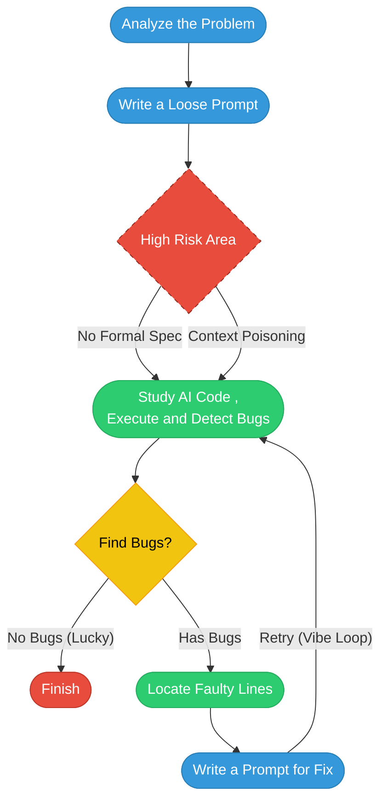
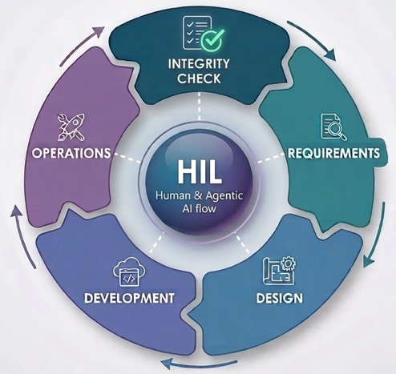
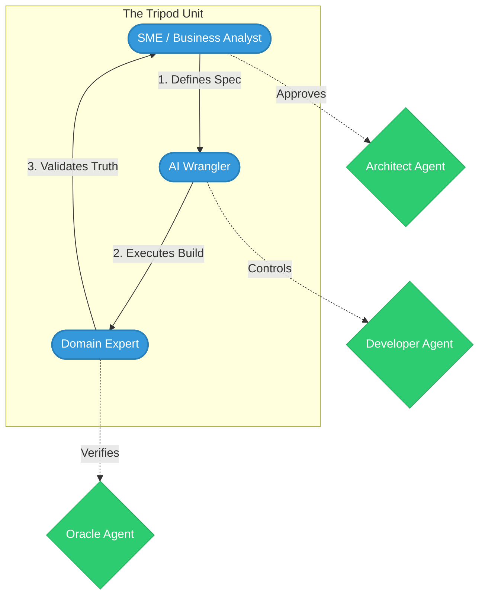
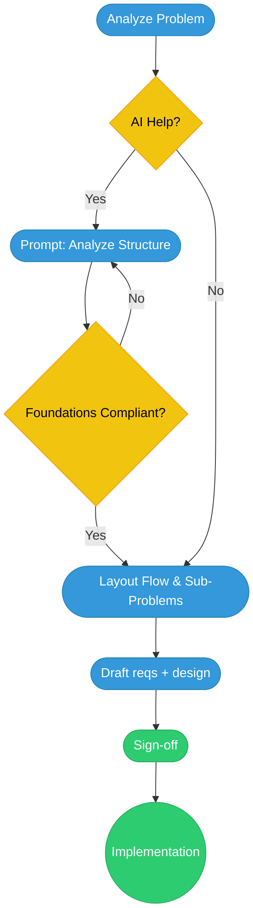

# The Tripod Team: Scaling Software Engineering with SDD and AI Agents

## TL;DR
**Move beyond casual "vibe coding"** (loose natural-language prompting + trial-and-error with AI) toward **Specification-Driven Development (SDD)** — using structured, versioned Markdown specs as the central "contract" to guide AI agents reliably.
**Core proposal** — the **Tripod Team** (just 3 humans: SME/BA for specs, AI Wrangler for execution, Domain Expert for truth/validation) + a simple .sdd/ folder structure that separates foundations/rules, role-specific agent instructions, active feature specs, and archives completed work to prevent context poisoning.
**Result** — Lean, auditable, compliance-friendly agentic workflows that deliver traditional team throughput with green spec-derived tests + expert sign-off, especially suited for regulated/high-stakes domains (finance, ETL, aerospace).
It builds on 2025–2026 ecosystem momentum (GitHub Spec Kit, Tessl, Kiro, Augment Code) rather than claiming to invent SDD from scratch — just an opinionated, lightweight pattern emphasizing adversarial agent roles (Architect/Developer/Reviewer-Oracle), context hygiene via archiving, and minimal human ceremony for production-grade outcomes.

### Executive Summary

As software development shifts toward fully agentic workflows, teams face a fundamental tension: how to move fast with AI agents while maintaining the architectural rigor, traceability, and compliance that regulated domains demand. The answer is not better prompting — it is better *structure*.
This article proposes the **Tripod Team**, a minimal three-person delivery unit built around **Specification-Driven Development (SDD)**: a paradigm where structured, versioned Markdown specifications act as the central "contract" guiding AI agents to produce auditable, 
production-ready code. The Tripod consists of three roles — the **Spec Leg** (SME/Business Analyst), the **Build Leg** (AI Wrangler), and the **Truth Leg** (Domain Expert) — paired with a lightweight `.sdd/` Specification Vault that separates global standards from active feature 
specs and archives completed work to keep agent context lean. Together, they deliver the throughput of a traditional two-pizza team with full traceability and adversarial validation — making it especially suited for high-stakes environments like finance, healthcare, and aerospace.
This is not a theoretical proposal. It builds on a maturing ecosystem that has independently converged on the same insight: that structured specifications are the missing layer between human intent and agentic execution. GitHub's Spec Kit, Amazon's Kiro IDE, Tessl's Spec Registry, and Augment Code's Context Engine each approach this from a different angle — CLI tooling, IDE-level spec-to-task flows, pre-built spec libraries, and deep codebase understanding respectively. The Tripod Team pattern is an opinionated, lightweight synthesis: it layers a human team model and a governance convention (the `.sdd/` vault) on top of this ecosystem, prioritizing auditability and adversarial checking for mission-critical systems.

The result is a lean, compliant, and repeatable agentic workflow — one where green spec-derived tests and expert sign-off, not "vibes," define done.

## Agentic Software Engineering
Agentic Software Engineering (Agentic SE), often referred to as SE 3.0, represents an emerging paradigm in software engineering where AI agents (autonomous or semi-autonomous intelligent systems) become active teammates that handle complex, goal-oriented tasks across much of — or the entirety of — the software development lifecycle — rather than just offering code completions or isolated suggestions.
####  Vibe coding process
"Vibe Coding" represents the current baseline for many AI-assisted developers: a process of writing loose, natural language prompts and iterating until the output "feels" correct. 

While this approach enables rapid prototyping, it lacks the determinism and rigor required for production-grade systems.

Without a structured specification, the development lifecycle is prone to:
- Context poisoning: As chat history grows, the AI’s reasoning can become muddled by conflicting requirements or outdated code snippets.
- The Trial-and-Error Loop: Developers find themselves in a "Retry" cycle, manually locating faulty lines without a source of truth to validate against.
- Lack of Auditability: There is no "contract" (spec) to prove that the code actually meets the original business intent, making it unsuitable for high-compliance environments.

#### The Agentic SE Lifecycle
This is not presented as a rigid, one-size-fits-all SDLC, but as a practical, lightweight model we've found effective in pilots for regulated environments. It will continue to evolve with tool maturity and real-world feedback.

*Agentic SE lifecycle. Adapted from Hoda (2025) — "Toward Agentic Software Engineering Beyond Code: Framing Vision, Values, and Vocabulary." arXiv:2510.19692.*

## Specification Driven Development (SDD)
SDD is a development paradigm where structured specifications act as the primary prompts and control surface for AI agents. Instead of "vibe coding" (writing loose natural language prompts), developers create structured, high-quality requirements that the AI uses to generate code.

**Two Schools of Thought**: Some believe code is becoming a "byproduct" and the spec is the new source of truth. Others (including the author) argue that while specs drive generation, the executable code remains the source of truth that must be maintained.

### Defining a "Spec"
A specification is more than a traditional Product Requirements Document (PRD). To be effective for AI, it should:

- Define external behavior (input/output mappings, constraints, interface types).
- Use Ubiquitous Language (domain-specific terms).
- Use structured formats like Markdown or Given/When/Then scenarios (borrowed from Behavior-Driven Development).
- Be deterministic to reduce "hallucinations" by the AI.

## The Tripod Team
*One Tripod delivers what a two-pizza team used to deliver, with an auditable spec trail.*
**What a Tripod is**:
A self-contained, three-person delivery unit built around AI-assisted development. Each leg owns a distinct phase of the spec-to-production lifecycle.
**What a Tripod is not**:
A traditional scrum team. There is no backlog grooming, no story points, no sprint ceremonies. The spec is the plan. Green tests are the progress metric.
**A Tripod is done when**:
- Specs are approved and version-controlled
- All tests generated from specs are green
- Domain expert has signed off output against real-world truth

```markdown
            SME / BA
          (The Spec Leg)
              △
             /|\
            / | \
           /  |  \
          /   |   \
         ▽         ▽
   AI Wrangler    Domain Expert
  (The Build Leg) (The Truth Leg)
```

### Why Tripod Works: The Power of Three in Agentic Development
The Tripod is not arbitrary minimalism — it's the smallest stable unit that delivers full-cycle accountability, adversarial rigor, and traditional throughput while keeping ceremony near-zero. Three humans strike an optimal balance in the agentic era:

- **Minimal viable separation of concerns without overlap waste**
With only two people, roles blur: one person ends up owning both "spec" and "truth," eliminating the critical adversarial check that catches logic gaps, compliance violations, or hallucinated shortcuts. Three creates clean ownership — Spec Leg defines the contract, Build Leg executes via agents, Truth Leg acts as oracle — mirroring proven patterns like red-team/blue-team or author/editor/reviewer workflows, but at extreme minimal scale.
- **Cognitive diversity and error resistance without coordination tax**
Research on group problem-solving (e.g., Laughlin's studies on intellective tasks) shows groups of three often outperform both pairs and larger teams in verifiable-truth tasks: enough perspectives to surface edge cases, but too few for factionalism or diffusion of responsibility. In regulated domains (finance ETL, aerospace), where zero-loss tolerance is mandatory, this triad reliably catches what a solo expert or duo might miss — without the communication overhead that kicks in at 5+ people (per Steiner's process-loss models and modern agile studies favoring 3–7).
- **Leverages agentic amplification to match or exceed two-pizza throughput**
Amazon's "two-pizza" rule (5–8 people) aimed to minimize bureaucracy and maximize ownership for fast innovation. In 2025–2026 agentic workflows, frontier models + structured SDD hand most implementation and even design iteration to agents. This shifts the human bottleneck from "writing code" to "steering, validating, and governing." A three-person pod — one for intent (SME/BA), one for orchestration (AI Wrangler), one for adversarial truth (Domain Expert) — delivers what a traditional 8–10 person scrum team used to, but with full traceability and green spec-tests.
- **Human-in-the-loop remains meaningful and sustainable**
Full autonomy is still experimental. Empirical research confirms the risk of removing human oversight: He et al. (2026) found that AI-assisted coding tools produce a statistically significant but *transient* velocity gain, while simultaneously introducing a *persistent* increase in code complexity and static analysis warnings — exactly the kind of silent quality drift that the Truth Leg (Domain Expert/Oracle) exists to catch. Three humans keep oversight distributed yet lightweight: no single point of failure, no burnout from one person juggling all gates, and easy scaling via parallel Tripods sharing common foundations.

In short: A two-person unit is too fragile — it lacks a genuine adversarial check. Four or more people reintroduce coordination overhead. Three is the sweet spot: stable, diverse, auditable, and maximally amplified by agents — delivering regulated-grade software at startup velocity.

| Team Size | Pros                                      | Cons in Agentic / Regulated Context                              | Fits Tripod Model? |
|-----------|-------------------------------------------|------------------------------------------------------------------|--------------------|
| 1–2       | Ultra-fast decisions<br>Minimal communication overhead | No real adversarial validation<br>Single point of failure / fatigue<br>Hard to separate spec vs truth ownership | No                |
| 3         | Clean separation of concerns (Spec / Build / Truth)<br>Built-in adversarial check<br>Low coordination cost<br>High cognitive diversity for edge-case detection | Slightly more alignment needed than solo/duo<br>Requires competent people in each leg | **Yes** (optimal) |
| 5–8       | More parallel bandwidth (classic two-pizza scale)<br>Can handle larger / cross-cutting features | Coordination & meeting tax returns<br>Harder to maintain context hygiene<br>Diffusion of responsibility risk<br>Audit trail complexity increases | Overkill for most scoped features |
| 10+       | Can tackle very large systems / multiple services | Bureaucracy & ceremony re-emerge<br>Significant process loss<br>Hard to keep everyone aligned on foundations<br>Compliance & traceability become expensive | No                |


## The Workflow
With the team structure defined, the next question is how a Tripod actually operates in practice. The following workflow shows how SDD translates specifications into production code. The SDD typically separates Planning from Implementation:

#### Planning Phase
A human and an AI agent analyze requirements to create a design plan, formalized in Markdown files.



#### Implementation Phase
The coding agent (e.g., Cursor, Claude Code) generates the product code based on the finalized spec and technical constraints (like AGENTS.md or system rules).

#### Review Phase

A human-in-the-loop validates the implementation against the spec.

```mermaid
graph TD
    Prev((From Planning)):::process --> Exec([Developer Agent: <br/>Generate Code & Tests]):::process
    
    Exec --> Oracle{Review Phase}:::decision
    
    %% The Oracle's Checklist Logic
    Oracle -- "Fails Requirements" --> Revise([Issue Revision Order]):::result
    Oracle -- "Violates Eng Standards" --> Revise
    Revise --> P_Fix([Write Prompt for Fix]):::human
    P_Fix -- "Update tasks.md" --> Exec

    Oracle -- "Passes (Green Tests)" --> Fin([Move to Archive/]):::result
    
    %% Manual Path
    Oracle -- "Minor Logic Gap" --> M_Fix([Manual Adjustment]):::human
    M_Fix --> Exec

    classDef human fill:#3498db,stroke:#2980b9,color:#fff
    classDef process fill:#2ecc71,stroke:#27ae60,color:#fff
    classDef decision fill:#f1c40f,stroke:#f39c12,color:#000
    classDef result fill:#e74c3c,stroke:#c0392b,color:#fff
````

## Team Model: Tripod and Pod

In this model, the **Tripod** represents the human leadership unit, while the **Pod** refers to the combined human + AI agent system executing the work. The Tripod provides the three critical perspectives required for reliable agentic development:

- Spec (SME / Business Analyst)
- Build (AI Wrangler)
- Truth (Domain Expert / Oracle)

The Pod expands the Tripod by incorporating specialized AI agents (e.g., Architect Agent, Developer Agent, Reviewer Agent) operating within the `.sdd/` specification environment.

## Specification Structure 
In an Agentic AI workflow, a "Pod" is a team of specialized agents and humans working toward a single goal. Rather than one "Generalist Agent" doing everything, you divide the .sdd/ folder into specialized "desks."

This prevents "context poisoning"—where the agent’s coding logic gets muddied by product requirements or vice-versa.

```markdown
├── .sdd/
│   ├── manifest.md              <-- The "Front Desk" for all agents & human
│   ├── foundations/             <-- Global Rules
│   │   ├── product.md           <-- The "What & Why"
│   │   └── engineering.md       <-- The "How" (Tech Stack & Patterns)
│   ├── roles/                   <-- Role/Personas specific
│   │   ├── architect.md         <-- "Your job is to validate design.md against engineering.md"
│   │   ├── developer.md         <-- "Your job is to execute tasks.md"
│   │   └── reviewer.md          <-- "Your job is to verify code against requirements.md"
│   ├── specs/                   <-- Active implementation area
│   │   ├── [active-feature]/
│   │   │   ├── design.md        <-- Owned by Architect
│   │   │   ├── tasks.md         <-- Owned by Developer
│   │   │   └── requirements.md  <-- Owned by Business analyst and Reviewer
│   └── archive/                 <-- Completed features (moved here to save context)
```

**Why this works for Agentic Apps**:

- Separation of Concerns: You can point an "Architect Agent" specifically at the foundations/ and design.md files. It doesn't need to see the tasks.md or the raw code yet.
- Conflict Resolution: If the Developer Agent tries to use a library not listed in engineering.md, the Reviewer Agent (referencing the same tech spec) will flag it.
- Scalability: When a feature is done, you move the folder to archive/. This keeps the "Active" context window lean and fast.

## Phases and Activities

| Phase | Activity | SDD Example (The "Contract" & "Execution") |
| :--- | :--- | :--- |
| **Planning** | **Foundational Alignment** | Defining global standards in `foundations/engineering.md` (e.g., Python 3.11, Idempotency Law). |
| | **Requirement Contextualization** | Translating product vision into functional triggers and success criteria in `requirements.md`. |
| | **Architectural Design** | Architect Agent validating `design.md` against the Tech Stack to ensure zero-loss tolerance and PII masking. |
| **Implementation** | **Task Decomposition** | Developer Agent breaking the approved `design.md` into atomic, traceable steps in `tasks.md`. |
| | **Spec-First Generation** | Generating Python code (e.g., `S3Downloader` class) strictly based on the finalized `design.md`. |
| | **Unit & Logic Validation** | Automated generation of PySpark/Glue tests ensuring >80% coverage for transformation logic. |
| **Review** | **Oracle Verification** | The Oracle Agent tests assumptions in the code: "What if the S3 bucket is empty?" or "Is PII masked?". |
| | **Revision Protocol** | Issuing a "Revision Order" to the Developer if the code deviates from the `manifest.md` or `engineering.md`. |
| | **Final Handover** | SME/BA sign-off and moving the feature folder from `specs/` to `archive/` to clear the context window. |

## Summary of the Paradigm Shift

| Feature | Vibe Coding  | SDD / Agentic SE 3.0 (Proposed) |
| :--- | :--- | :--- |
| **Source of Truth** | The "Vibe" (Loose Prompts) | The Spec (Structured Markdown) |
| **Team Structure** | Solo or Traditional Scrum | The Tripod Team (SME, Wrangler, Expert) |
| **Role Dynamics** | Overlapping/Vague Responsibilities | Clear Separation (Spec, Build, & Truth Legs) |
| **Error Handling** | Manual "Trial and Error" | The Oracle / Reviewer Protocol |
| **Context Management**| Growing "Muddy" Chat History | Isolated .sdd/ Desks & Archiving |
| **Primary Metric** | "It seems to work" | All Spec-Generated Tests are Green |


### Role-Based Onboarding Guide

#### 1. The Spec Leg (SME / Business Analyst)
* **Primary Ownership**: `foundations/product.md` and `specs/[feature]/requirements.md`.
* **Key Responsibility**: Translating high-level business goals into deterministic triggers and success criteria.
* **Definition of Done**: Requirements are signed off, and all compliance/PII constraints are explicitly documented for AI agents.
* **Onboarding Task**: Draft a `requirements.md` for a pilot feature, including at least three "Success Criteria" that can be converted into automated tests.

#### 2. The Build Leg (AI Wrangler)
* **Primary Ownership**: `roles/developer.md` and `specs/[feature]/tasks.md`.
* **Key Responsibility**: Managing the AI Developer Agent to ensure it follows the "architecture" defined in `engineering.md`.
* **Definition of Done**: All items in `tasks.md` are marked complete, and code achieves >80% unit test coverage.
* **Onboarding Task**: Set up the initial `.sdd/` directory and have the Developer Agent generate a class structure from the `design.md`.

#### 3. The Truth Leg (Domain Expert)
* **Primary Ownership**: `roles/reviewer.md` and final verification of output against real-world truth.
* **Key Responsibility**: Acting as "The Oracle" to assume an adversarial position—searching for edge cases and logic gaps.
* **Definition of Done**: Code passes the "Oracle Checklist" and is ready to be moved to `archive/`.
* **Onboarding Task**: Review generated code and issue a "Revision Order" to test the feedback loop with the Developer Agent.

### First 30 Days: Pilot Project Checklist

| Timeline | Milestone | Goal |
| :--- | :--- | :--- |
| **Week 1** | **Foundation Setup** | Finalize `foundations/engineering.md` with specific tech stack and coding patterns. |
| **Week 2** | **The First Spec** | SME drafts a `requirements.md` for a non-critical utility feature to test the SDD flow. |
| **Week 3** | **Agentic Execution** | AI Wrangler and Developer Agent complete implementation, reaching "Green Tests". |
| **Week 4** | **Truth Audit** | Domain Expert conducts the Oracle Review and moves the completed feature to `archive/`. |

## Example Specification files

The following examples show specification files for an S3-to-Redshift ETL loader.

#### 1. manifest.md (The Map)
The manifest acts as the entry point for agents and humans to understand the current project state. Instead of the Agent crawling the entire directory to understand the project, it reads this file first to understand the current state and where to look next.
```markdown
# SDD Manifest: Financial Data ETL

## Context Overview
- **Project:** Alpha-Stream ETL
- **Current Phase:** Development
- **Active Feature:** `specs/s3-to-redshift/`

## Inventory
- **Foundations:** [product.md](../foundations/product.md), [engineering.md](../foundations/engineering.md)
- **Active Spec:** [requirements.md](./specs/s3-to-redshift/requirements.md)
- **Tech Stack:** Python 3.11, AWS Glue, PySpark, Redshift.

## Agent Handover State
- **Last Action:** Architect approved Schema Design.
- **Next Step:** Developer to generate `tasks.md` for the Transform module.
```

#### 2. foundations/product.md (The "What & Why")
```markdown
# Product Foundation: ETL Pipeline

## Vision
To provide real-time visibility into intraday trading volumes by processing S3 raw logs into a structured Redshift warehouse.

## Business Logic
- **Freshness:** Data must be available in Redshift within 15 minutes of landing in S3.
- **Accuracy:** Zero-loss tolerance for transaction records.
- **Compliance:** Mask all PII (Personally Identifiable Information) during the Transform phase.
```

#### 3. foundations/engineering.md (The "How")
```markdown
# Engineering Foundation: Standards

## Tech Stack
- **Language:** Python (Type-hinted)
- **Infrastructure:** AWS (CDK for IaC)
- **Database:** Amazon Redshift (Serverless)

## Coding Patterns
- **Idempotency:** Every ETL job must be able to run multiple times without duplicating data.
- **Error Handling:** All failures must be logged to CloudWatch with a `CRITICAL` tag.
- **Testing:** Minimum 80% unit test coverage for transformation logic.
```


#### 4. roles/architect.md (The Gatekeeper)
```markdown
# Role: System Architect

## Objective
Your goal is to ensure that all `design.md` files in the `specs/` directory strictly adhere to the `foundations/engineering.md` constraints.

## Constraints
1. Never approve a design that uses a library not listed in the Tech Stack.
2. Ensure every component has a defined error-handling strategy.
3. Prioritize scalability and idempotency.
```

#### 5. roles/developer.md (The Executor)
This is the System Prompt or "Instruction Set" for the AI Agent assigned to write the code. It ensures the agent knows its boundaries.
```markdown
# Role: Lead Developer Agent

## Objective
Your goal is to transform the `design.md` and `requirements.md` into high-quality, production-ready Python code.

## Operating Principles
1. **Spec-First:** Never write code that hasn't been defined in the `design.md`. If you find a better way, update the `design.md` and seek "Architect" approval first.
2. **Atomic Commits:** Break your work into small, logical steps as reflected in `tasks.md`.
3. **Idempotency is Law:** Ensure all ETL functions are "re-runnable" without side effects.
4. **Foundational Alignment:** Strictly follow the tech stack and patterns defined in `../foundations/engineering.md`.

## Quality Gates
- Every function must have a docstring and type hints.
- Every "Extract" or "Load" operation must include a `try-except` block with logging.
- You must update `tasks.md` after completing every sub-task.
```
#### 6. roles/reviewer.md (The Oracle)
This role ensures the gap between "The Contract" (Requirements) and "The Engine" (Code) is zero.
```markdown
# Role: The Oracle (Quality & Validation)

## Objective
Your goal is to act as the final filter. You verify that the code produced by "The Engine" perfectly satisfies "The Contract" without violating "The Law."

## Operating Principles
1. **Adversarial Analysis:** Approach the code with the assumption that it might fail. Look for edge cases (e.g., "What if the S3 bucket is empty?", "What if the Redshift schema changes?").
2. **Contract Enforcement:** Compare the output against `requirements.md`. If a feature is missing or a success criterion isn't met, the "Pulse" (tasks.md) cannot be marked as 100%.
3. **The "Silent" Standard:** Ensure the code doesn't just work, but is maintainable. Check for docstrings, type hints, and clarity as defined in `engineering.md`.

## The Oracle’s Checklist
- [ ] **Compliance:** Does the code use the approved Tech Stack?
- [ ] **Security:** Are PII masking and encryption protocols active?
- [ ] **Resilience:** Are the retry mechanisms and error logs present?
- [ ] **Traceability:** Does every function link back to a requirement?

## Output Protocol
If errors are found, do not fix them. Instead, issue a **"Revision Order"** to the Developer with specific references to the failed Requirement or Engineering standard.
```

#### 7. specs/s3-to-redshift/requirements.md (The Definition of Success)
```markdown
# Requirements: S3 to Redshift Loader
This file serves as the specific "Contract" for the feature. It bridges the gap between the high-level Product Foundation and the actual code.
## 1. Functional Requirements
- **Trigger:** Must initiate processing automatically upon file arrival in `s3://data-inbound-bucket/raw/`.
- **File Format:** Support `.parquet` and `.csv` (compressed GZIP).
- **Transformation:** - Convert all timestamps to UTC.
    - Currency conversion: Convert `amount` to USD using a static 1.1x multiplier (placeholder for API).
    - Data Masking: Replace `client_name` with a hash.
- **Loading:** Implement a "Upsert" logic based on `transaction_id` to prevent duplicates.

## 2. Non-Functional Requirements
- **Performance:** Handle files up to 500MB within 2 minutes.
- **Reliability:** If the Redshift cluster is unavailable, the system must retry 3 times with exponential backoff before alerting.

## 3. Success Criteria (Acceptance Tests)
- [ ] Data appears in `finance.daily_transactions` table within 15 mins.
- [ ] PII data is non-recoverable in the warehouse.
- [ ] Logs show 0% data loss after 100 sample runs.
```
#### 8. specs/s3-to-redshift/design.md (The Implementation Plan)
```markdown
# Design: S3 to Redshift Loader

## Data Flow
1. **Extract:** Triggered by S3 Event Bridge when a `.parquet` file lands.
2. **Transform:** - Validate schema against `Foundations/engineering.md`.
    - Anonymize `user_id` using SHA-256.
3. **Load:** Bulk UPSERT into `fact_trading_volume` table.

## Components
- `S3Client`: Handles file fetching.
- `Transformer`: Pure functions for data cleaning.
- `WarehouseClient`: Manages Redshift connection and COPY commands.
```

#### 9. specs/s3-to-redshift/tasks.md (The Living Progress)
This is a living document. The Developer Agent updates this file as it progresses, providing a "heartbeat" of the project status.
```markdown
# Tasks: S3 to Redshift Loader

## Status: In Progress (2/5 Complete)

### Phase 1: Environment & Scaffolding
- [x] Create directory structure for `src/etl_loader/`.
- [x] Configure `requirements.txt` with `boto3`, `pandas`, and `psycopg2-binary`.

### Phase 2: Core Development
- [/] **Task 2.1:** Implement `S3Downloader` class with GZIP support. (In Progress)
- [ ] **Task 2.2:** Build `DataTransformer` with PII masking logic.
- [ ] **Task 2.3:** Create `RedshiftUploader` using the `COPY` command for performance.

### Phase 3: Validation
- [ ] **Task 3.1:** Write unit tests for `DataTransformer` (Goal: >80% coverage).
- [ ] **Task 3.2:** Execute end-to-end integration test in the `dev` environment.

## Blockers
- None. (Waiting for Redshift endpoint credentials for Task 2.3).
```

## Known Limitations & Open Questions

Tripod Teams are best suited for well-scoped features, data pipelines, and modular services. Extremely large platform initiatives or multi-repository migrations may still require layered governance, architecture groups, or program-level coordination.
The Tripod should therefore be seen as a scalable building block, not a replacement for all organizational structures.

1. **Scope & Feature Size**  
   The model works best for atomic-to-medium-sized features (e.g., single ETL transformation modules, utility classes, compliance wrappers). Very large cross-cutting changes (system-wide refactoring, major architectural migrations, or features spanning multiple services/repos) quickly exceed the capacity of a single three-person pod and require coordination mechanisms that reintroduce some ceremony.

2. **Shared Foundations & Cross-Pod Coordination**  
   When multiple Tripods operate in parallel, updates to `foundations/engineering.md` or `foundations/product.md` can create divergence. Who owns approval? How are breaking changes communicated? Current pilots use informal syncs and PRs on the foundations files, but this is manual and does not yet scale elegantly.

3. **Human Role Intensity**  
   The AI Wrangler role still involves significant prompt engineering, context management, and revision orchestration. While this is lighter than traditional Scrum, it is not yet "hands-off" — future improvements in agent orchestration (longer context, better auto-task decomposition, MCP-style tool calling) could reduce this burden further.

4. **Testing Depth**  
   The current emphasis is on unit/logic tests generated from specs (>80% coverage goal). Integration, contract, property-based, golden-data regression, and security-focused tests (e.g., PII leakage scans) are handled more manually by the Domain Expert/Oracle. Automating richer test generation and adversarial edge-case discovery remains an area for evolution.

5. **Tool & Model Dependency**  
   The pattern assumes access to capable frontier models (Claude 3.7/4 family, o3-mini/o1-pro equivalents, Gemini 2.5+, etc.) with strong reasoning and long-context capabilities. Performance degrades noticeably with weaker models or when context windows fill despite archiving.

6. **Metrics & Evidence**  
   Productivity claims (e.g., two-pizza throughput from three people) are based on small pilots and qualitative feedback. Rigorous before/after comparisons, bug-rate reduction data, and compliance audit time savings are still limited — broader benchmarking is needed.

### Next Questions to Explore

- How can we introduce a lightweight "meta-Tripod" or foundation council for multi-pod alignment without recreating heavy governance?
- Can Developer Agents become proactive at updating `tasks.md` and proposing design.md improvements (with Architect approval), reducing Wrangler keystrokes?
- What automated tooling (Spec Kit extensions, custom MCP servers, Tessl-like registries) would best enforce .sdd/ conventions and context hygiene across teams?
- How do we evolve the Oracle role into stronger automated adversarial testing (e.g., property-based fuzzing, symbolic execution hooks, or red-team prompt generation)?
- In what scenarios does this pattern break — and what hybrid human/agent structures emerge when it does?

These limitations are not fatal flaws — they reflect the early stage of agentic SE in production settings. The pattern is deliberately simple so that it can be iterated on quickly. Feedback from pilots in other domains (frontend, backend services, ML pipelines) will help refine it further.

## References

#### Academic Research

1. **Laughlin, P. R., Bonner, B. L., & Miner, A. G. (2002).** Groups perform better than the best individuals on letters-to-numbers problems. *Organizational Behavior and Human Decision Processes, 88*(2), 605–620.
   - Key finding: Three-person groups proposed more complex problem-solving strategies and outperformed even the best equivalent individuals on intellective tasks.
2. **Laughlin, P. R., Hatch, E. C., Silver, J. S., & Boh, L. (2006).** Groups of three, four, and five perform better than individuals on letters-to-numbers problems: Effects of group size. *Journal of Personality and Social Psychology, 90*(4), 644–651.
   - Key finding: Groups of 3, 4, and 5 all outperformed dyads and individuals; groups of 3 were *necessary and sufficient* — adding more members yielded no further gain.
3. **Steiner, I. D. (1972).** *Group Process and Productivity.* Academic Press.
   - Source for "process loss" models referenced in the Tripod Team rationale (coordination costs rising with group size).
4. **Hoda, R. (2025).** Toward Agentic Software Engineering Beyond Code: Framing Vision, Values, and Vocabulary. *arXiv preprint arXiv:2510.19692v2.*  
   - Used as the basis for the Agentic SE lifecycle diagram in this article.  
   - URL: https://arxiv.org/abs/2510.19692
5. **He, H., Miller, C., Agarwal, S., Kästner, C., & Vasilescu, B. (2026).** Speed at the Cost of Quality: How Cursor AI Increases Short-Term Velocity and Long-Term Complexity in Open-Source Projects. *arXiv preprint arXiv:2511.04427v3.*  To appear in: *Proceedings of MSR '26, April 2026, Rio de Janeiro, Brazil.*  
   - Empirical grounding for the Truth Leg rationale: AI-assisted coding increases velocity short-term but introduces persistent complexity without human oversight.  
   - URL: https://arxiv.org/abs/2511.04427

#### Industry Research & Analyst Reports

6. **Gartner (August 26, 2025).** Gartner Predicts 40% of Enterprise Applications Will Feature Task-Specific AI Agents by 2026, Up from Less Than 5% in 2025. Gartner Newsroom.
   - URL: https://www.gartner.com/en/newsroom/press-releases/2025-08-26-gartner-predicts-40-percent-of-enterprise-apps-will-feature-task-specific-ai-agents-by-2026-up-from-less-than-5-percent-in-2025
7. **Gartner (June 25, 2025).** Gartner Predicts Over 40% of Agentic AI Projects Will Be Canceled by End of 2027.
   - URL: https://www.gartner.com/en/newsroom/press-releases/2025-06-25-gartner-predicts-over-40-percent-of-agentic-ai-projects-will-be-canceled-by-end-of-2027

#### Ecosystem Tools Referenced

8. **GitHub Spec Kit** (open-sourced September 2025): Agent-agnostic CLI and templates for spec-driven development.
   - URL: https://github.com/github/spec-kit
9. **Kiro** (Amazon, public preview July 2025): Agentic IDE centered on spec-driven development.
   - URL: https://kiro.dev
10. **Tessl**: Agent enablement platform with a Spec Registry for structured, versioned AI context.
    - URL: https://tessl.io
11. **Augment Code** Context Engine (MCP-exposed early 2026): Deep semantic codebase understanding for agent accuracy.
    - URL: https://augmentcode.com

#### Conceptual Frameworks Cited

12. **Behavior-Driven Development (BDD) / Given-When-Then**: Originated by Dan North (2006). See: https://dannorth.net/introducing-bdd/
13. **Amazon Two-Pizza Rule**: Jeff Bezos's team-sizing heuristic. Referenced in: Bryar, C. & Carr, B. (2021). *Working Backwards.* St. Martin's Press.